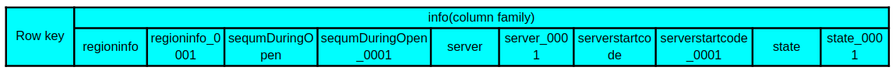
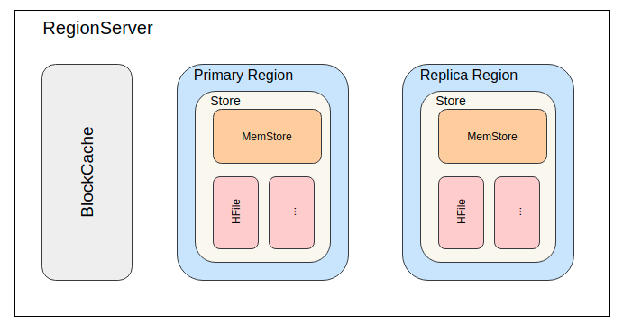
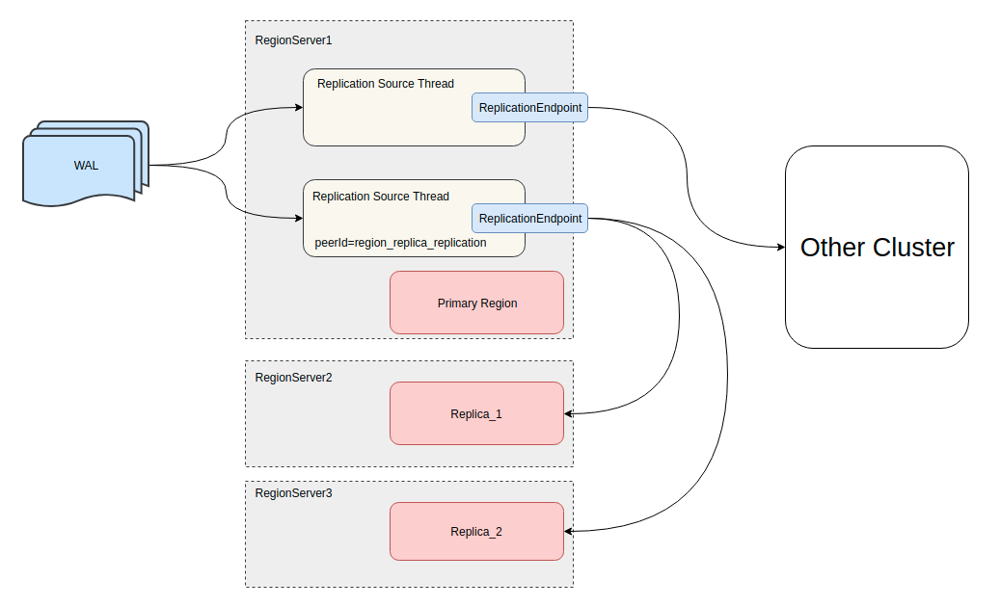

## 背景

CAP原理中，指出对于一个分布式系统来说，不可能同时满足一致性 (Consistency)、可用性（Availability）、分区容错性（Partition tolerance），而HBase则被设计成一个CP系统，保证了强一致性的同时，牺牲了一定的可用性。

在对HBase的压测中，很容易发现虽然HBase的平均读写延迟很低，但却存在很高的毛刺，P99、P999延迟很高，主要原因则是Region的MTTR（平均修复时间）。一旦某个RegionServer或某个Region出现问题，甚至是一次Full GC，都有可能出现较长时间的读不可用，影响读可用性。

HBase的Read Region Replicas功能，提供一个或多个Replica Region（备份Region）来支持最终一致性的读请求，在一些不要求强一致性的应用中，可以以此来降低读请求延迟。

## 设计

在此功能设计中，region被分为两类：Primary Region（主Region），支持读写请求；Replica Region（备份Region），只支持读请求。默认region replication为1，每个region只有1个Primary Region，此时与之前的region模型并无不同。当region replication被设置为2或更多时，Master将会assign所有region的Replica Region，Load Balancer会保证同一个region的多个备份会被分散在不同的RegionServer上。

对于client端来说，可以决定从任意一个region读取数据，无论这个region是主还是备，但却只能将写请求发送给Primary Region。

对于server端来说，Replica Region为只读模式，接收到写请求会直接抛出异常拒绝，而读请求正常处理，并且会在响应的`Result`中增加`state`标志数据是否来自Replica Region。

如此设计，保证Primary Region依旧可以保证强一致性，多region副本提供读可用性。

## 实现

### 数据模型

在实际实现时，对每个逻辑region的多个备份分别分配了一个replicaId，从0开始依次递增，replicaId为0的region为Primary Region，其他的都为Replica Region。



在上图中，是一个region replication为2的表在meta表中info列族下的列，可以看到有一些名为info:xxx_0001的列，这些列存储的数据就是replicaId=1的Replica Region的数据。同理，当region的备份数量更多时，meta表中名为info:xxx_0002、info:xxx_0003的列存储的则为replicaId为2、3的Replica Region的数据。

### 数据同步

Replica Region要支持读请求，则必然要有数据，而Replica Region又不支持写请求，那么数据是哪来的呢？



从HBase的数据模型上看，数据主要分为两部分：MemStore和HFile。HFile存储于HDFS上，Replica Region只要及时获知HFile的变化便可以获取。但MemStore存在于内存，却只有Primary Region持有。以下便介绍两种Replica Region同步数据的方式。

#### StoreFile Refresher

第一种方式是StoreFile Refresher，在HBase-1.0+版本引入。在RegionServer上有一个StorefileRefresherChore任务，会定期地在HDFS上检查Primary Region的HFile有没有变化，以此来及时的发现Primary Region通过flush、compact、bulk load等操作产生的新HFile。

该方案实现上较为简单，也不需要太多多余的存储和网络开销，但缺点也非常明显，在数据写入Primary Region，到Replica Region可以读到数据，有相当长的时间间隔，中间需要等待memstore的flush和StorefileRefresherChore任务的定时刷新。

如果要开启这个功能，只要将`hbase.regionserver.storefile.refresh.period`配置设置为非零值即可，表示StorefileRefresherChore任务刷新的时间间隔。

#### Asnyc WAL replication

HBase有提供集群间replication功能，利用WAL在多个集群之间同步数据。在HBase-1.1+版本中，便利用replication在集群内部同步数据，将实时写入的WAL同步到Replica Region。



如上图中所示，通过实现一个特殊的`ReplicationEndpoint`便可以将WAL的数据同步给集群中的其他RegionServer。如此Primary Region MemStore中的数据，也通过replication实时同步到Replica Region，从Replica Region中也可以读到Primary Region还没有flush到HFile的数据。所以利用`Asnyc WAL replication`的同步方式比上面讲到的`StoreFile Refresher`同步方式具有更低的同步延迟。

Primary Region还会将flush、compaction和bulk load事件写到WAL，同样由replication功能同步到Replica Region。当Replica Region接收到这些事件时，便也回放同样的事件来更新自己的数据。所以对HFile文件列表的更新也比`StoreFile Refresher`定时刷新的方式更加实时。

在这种同步模式下，Replica Region的MemStore中也是有数据，从WAL同步的Put/Delete操作就像Primary Region一样写入MemStore，并且Replica Region也会使用block cache，所以在这种模式中内存的开销会成倍的增长。不同于Primary Region的是，Replica Region在接收到flush事件时，并不会将MemStore中的数据flush成HFile，只会释放掉MemStore占用的内存。

`Asnyc WAL replication`功能默认是关闭的。需要设置`hbase.region.replica.replication.enabled`为`true`来打开这个功能。当第一次创建一个region replication大于1的表时，将会创建一个名为`region_replica_replication`的replication peer，这个replication peer将负责集群内所有表region replica的数据同步。一旦开启之后想要再关闭该功能，就不只是改`hbase.region.replica.replication.enabled`为`false`了，还需要disable掉`region_replica_replication`这个replication peer。

### 存在的问题

#### HFile的过期时间

在以上两种数据同步方式中，都会在多个RegionServer上打开同一个HFile，所以当Primary Region进行完了major compaction之后，Replica Region因为HFile文件变化更新不及时，依旧引用着旧的HFile。目前并没有有效的措施保证HFile文件并不会被过早的删除。只能是将配置项`hbase.master.hfilecleaner.ttl`设置为一个较大的值，比如一小时，以此来尽量避免请求过程中不会出错。但同时也会增加HDFS的存储开销。

#### replication不能同步meta表数据

目前的Async WAL Replication功能并不能同步meta表的WAL数据。所以对于meta表的操作，并不能通过replication尽快的同步到Replica Region，只能通过类似于`StoreFile Refresher`的方式，使用定时刷新的任务来同步meta表HFile文件的变化。

`hbase.regionserver.meta.storefile.refresh.period`配置项用于控制meta表StoreFile的更新时间。该配置项并不同于`StoreFile Refresher`功能的`hbase.regionserver.storefile.refresh.period`。

#### 内存消耗

在之前已经提到，Async WAL Replication同步因为使用MemStore和block cache，会导致内存开销成倍增加。并且Replica Region并不会主动进行flush，只会当接收到同步的WAL中的flush事件时，才会进行flush。在一些极端情况下，比如replication阻塞收不到flush事件、Primary Region确实长时间没有进行flush，Replica Region持有的内存得不到释放，而一个RegionServer上同时有多个Primary Region和Replica Region，内存的过度消耗可能会阻塞Primary Region正常的写入操作，也会阻塞replication同步的flush事件。

所以HBase提供了一个配置项`hbase.region.replica.storefile.refresh.memstore.multiplier`，默认值为4，表示如果Replica Region的MemStore比Primary Region最大的MemStore的4倍还要大时，便允许Replica Region自行refresh检查HFile文件是否变化，如果Primary Region早已flush过，却因为replication阻塞没有同步到，则可以利用该机制进行flush。默认情况下最好不要执行这个操作，可以把该配置项设置大一些来避免。

#### Replica Region Failover

当一个Replica Region刚open或者fail over，此时必然丢失了之前MemStore的数据，因为Replica Region毕竟不能像Primary Region一样通过回放WAL来恢复MemStore。如果此时直接提供读服务，则可能出现数据版本回退的问题，即恢复之后比恢复之前读到的数据更旧。为了避免数据回退，Replica Region就必须等待Primary Region进行一次完整的flush操作或open region事件，在这之前，Replica Region都将拒绝接服务。

`hbase.region.replica.wait.for.primary.flush`配置项是该机制的开关，默认是`enable`开启。

## 使用

### 配置

更新更详细的配置说明建议参考[官方文档](http://hbase.apache.org/book.html#_configuration_properties)。

### 建表

`REGION_REPLICATION`参数控制表中region有多少备份，默认值为1，即只有Primary Region。

shell方式建表
```shell
create 't1', 'f1', {REGION_REPLICATION => 2}
```
shell方式修改表
```shell
alter 't1', {REGION_REPLICATION => 2}
```

### Client

Client访问Replica Region必须要用户明确的表示可以接收非强一致性的数据，HBase为此提供了一个`Consistency`枚举，请求默认都是`STRONG`的一致性，如果希望请求可以发送给Replica Region，必须明确指定为`TIMELINE`的一致性。
```
public enum Consistency {
    STRONG,
    TIMELINE
}
```

#### Shell

允许以`TIMELINE`的一致性读取数据
```shell
hbase(main):001:0> get 't1','r6', {CONSISTENCY => "TIMELINE"}
```
```shell
hbase(main):001:0> get 't1','r6', {CONSISTENCY => "TIMELINE", , REGION_REPLICA_ID => 1}
```

#### Java
Get
```Java
Get get = new Get(row);
get.setConsistency(Consistency.TIMELINE);
...
Result result = table.get(get);
```
Scan
```Java
Scan scan = new Scan();
scan.setConsistency(Consistency.TIMELINE);
...
ResultScanner scanner = table.getScanner(scan);
```

可以通过`Result.isStale()`判断数据是否来自于Replica Region
```Java
Result result = table.get(get);
if (result.isStale()) {
  ...
}
```

## 总结

`Region Replica`功能可以提供HBase的读可用性，但也要根据具体的用例考虑是否适用。

### 优点

- 对于只读的表可以用来提高可用性
- 对于部分不要求强一致性（要求最终一致性，可以接受短时间内数据不一致）的应用，可以使用该功能来提高读可用性
- 对于部分不要求强一致性的应用，可以使用该功能降低读请求P999、P9999延迟

### 缺点

- 多倍的MemStore导致更多的内存消耗
- 增加block cache的需求和使用
- 为了传输WAL导致更多的网络带宽消耗
- 大量的集群内部RPC请求

## 参考

- [Timeline-consistent High Available Reads](http://hbase.apache.org/book.html#arch.timelineconsistent.reads)
- [Phase 1 Design HBASE-10070](https://issues.apache.org/jira/browse/HBASE-10070)
- [Phase 2 Design HBASE-11183](https://issues.apache.org/jira/browse/HBASE-11183)
- [HighAvailabilityDesignforreadsApachedoc.pdf](https://issues.apache.org/jira/secure/attachment/12616659/HighAvailabilityDesignforreadsApachedoc.pdf)
- [An In-Depth Look at the HBase Architecture](https://mapr.com/blog/in-depth-look-hbase-architecture/)
