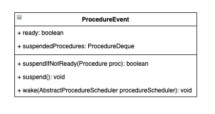
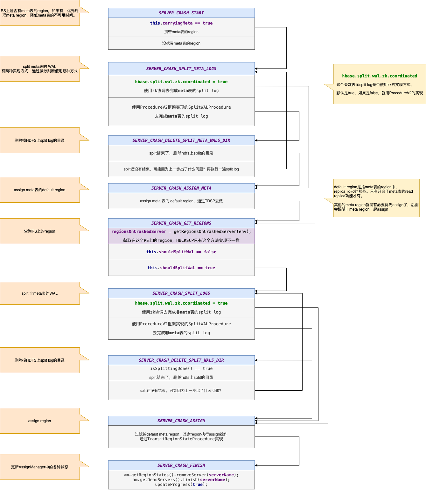
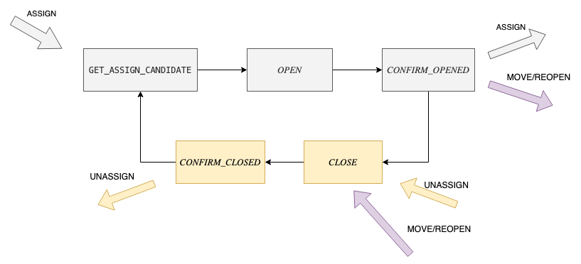
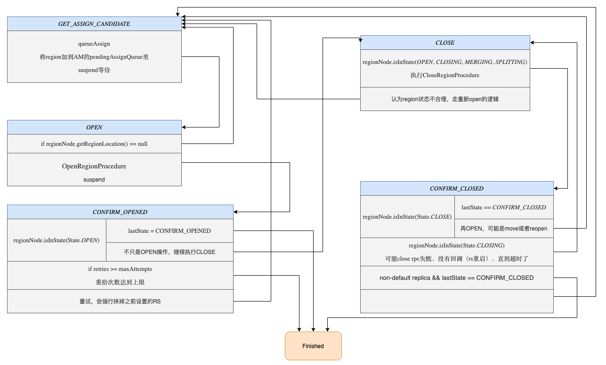
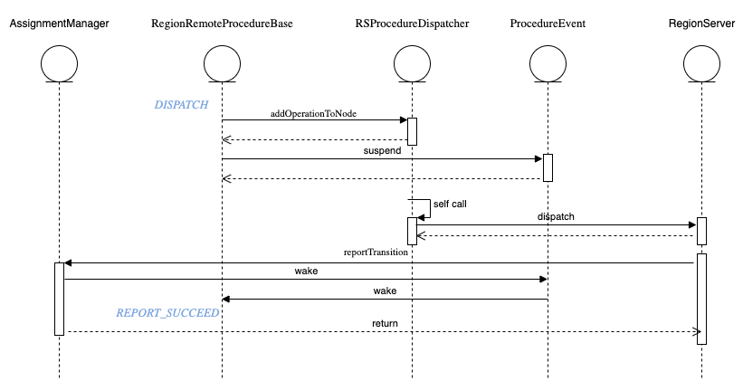

最近在组内进行的一次SCP和TRSP两个Procedure执行过程的分享，在这里记录一下，懒得去整理出文章了 :stuck_out_tongue_winking_eye:

<!-- truncate -->


## AMv2

### 比较重要的类


#### AssignmentManager

管理Region的assign/unassign操作，管理Region的状态信息。

其中主要属性：
- RegionStates: 管理内存中的Region状态信息，RS上有哪些region
- RegionStateStore: 操作meta表

#### RegionStateNode

- lock: 对Region状态信息和RegionLoacation信息加锁，防止并发修改。
- regionInfo: Region信息
- event: 用于多个procedure等待Region的某个状态变化，比如open、close。
- procedure: 记录唯一绑定的TRSP，保证每个Region只能同时进行一个TRSP。
- regionLocation: region要被assign到哪个RS。

#### ProcedureEvent

用于多个Procedure等待某个依赖的事件，在AMv2中，主要的就是等待Region的状态变化。



事件状态就两种：
- ready: 某个事件已准备好，可以继续执行
- suspend: 事件未准备好，之后调用suspendIfNotReady()方法的Procedure都会被加到 suspendedProcedure队列里，用于之后唤醒。

主要方法：
- suspendIfNotReady: 如果是ready状态，表示可以继续执行；如果suspend状态，Procedure会被加到 suspendedProcedure队列里，用于之后唤醒。这时候Procedure会抛出ProcedureSuspendedException，Pv2框架会暂停Procedure的执行，等待被唤醒。

这个功能有个问题就是只保存在内存中，无法恢复，如果Procedure使用不好，Master重启，等待队列无法恢复，Procedure可能永远无法被唤醒。

## ServerCrashProcedure

### 触发条件

#### zk session expire（被动触发）

监听zk上rs节点的变化，如果代表某个rs的子节点被过期删除，就触发SCP。

配置: {zookeeper.znode.parent}/{zookeeper.znode.rs}/

默认: /hbase/{cluster name}/rs/

此种情况下，如果rs处于非ONLINE状态，不会强制执行ServerCrashProcedure

#### HBCK2 （主动触发）

要使用完整的ServerName，包含后面的startcode。

```
./hbase hbck -j hbase-hbck2-1.0.0-SNAPSHOT.jar scheduleRecoveries c4-hadoop-tst-st84.bj,55600,1586416554312 c4-hadoop-tst-st85.bj,55600,1586415546993
```

无论rs是否处于ONLINE状态，都会强制执行 HBCKServerCrashProcedure（ServerCrashProcedure的子类），大多数情况下行为和ServerCrashProcedure一样，不同的地方在于getRegionsOnCrashedServer方法：

如果ServerCrashProcedure.getRegionsOnCrashedServer返回空集合，HBCKServerCarshProcedure会scan读meta表，将meta表上记录的Opening和Opened两种状态的region返回，另外将Closing状态的region改为Close。

### 状态变化

**准备工作**

将当前处理的rs加到 DeadServer processing list。在SCP执行结束之后，才加到 DeadServers list。每个状态都会检查下，是否加进去了。

**等待meta表可用**

```
case SERVER_CRASH_START:
case SERVER_CRASH_SPLIT_META_LOGS:
case SERVER_CRASH_DELETE_SPLIT_META_WALS_DIR:
case SERVER_CRASH_ASSIGN_META:
break;
default:
// If hbase:meta is not assigned, yield.
if (env.getAssignmentManager().waitMetaLoaded(this)) {
    throw new ProcedureSuspendedException();
}
```

前面几个状态都是操作meta表的region的状态，所以meta表不可用也会执行，其他的状态会操作普通region，涉及到meta表的读写，所以其他状态都要求meta表的region可用，才可以继续执行。这里就利用了ProcedureEvent这个类的功能，等待meta region加载完成之后才允许继续下面的状态，否则直接抛出ProcedureSuspendedException暂停当前Procedure的执行，等待被唤醒。

**但这里好像使用AssignmentManager.metaAssignEvent更合适**。因为meatLoadedEvent只有在Master启动之后才会触发一次，metaAssignEvent在Master启动和每次meta region open都会触发，所以metaAssignEvent来代表meta region可用更合适一些。



- START: 没有什么实际操作，根据RS上是否有meta表的region，来判断下一步的状态
- SPLIT_META_LOGS: split meta表的WAL
- DELETE_SPLIT_META_WALS_DIR: 删除HDFS上meta表split log的目录
- ASSIGN_META: 重新assign meta region
- GET_REGIONS: 查询RS上除meta外的region
- SPLIT_LOGS: split非meta表的WAL
- DELETE_SPLIT_WALS_DIR: 删除HDFS上非meta表的WAL目录
- ASSIGN: assign 非meta的region
- FINISH: 收尾工作，将RS加到 DeadServers list，触发CP

其实这些状态主要可以做的就是Split WAL，Delete WAL dir，Assign region这三类，只不过将Region按是否是meta做了区分，meta region和普通region分别做了这三类操作。这里我理解原因应该是普通的region assign需要读写meta表，所以要求meta表的region必须可用才行，所以优先对meta region进行三步操作处理，meta region可用之后才会进行普通region的三步操作。

### 问题

**执行SCP的时候，RS上的region是怎么处理的？**

直接置为ABNORMALLY_CLOSED，认为所有的region都已经不可用了。

如果region有TRSP在进行，就进一步通知所有这些region的TRSP和RRP，做对应的操作。
如果没有，就新加TRSP去assign这些region。

如果rs再恢复或启动的话，也应该会发现zk的节点丢了，不能直接open它的region。（这个没有去看代码确认）

## TransitRegionStateProcedure

### 主要变量

**type/initialState/lastState**

| type | initialState | lastState |
| --- | --- | --- |
| ASSIGN | GET_ASSIGN_CANDIDATE | CONFIRM_OPENED |
| UNASSIGN | CLOSE |  CONFIRM_CLOSED |
| MOVE | CLOSE | CONFIRM_OPENED |
| REOPEN | CLOSE | CONFIRM_OPENED |


**remoteProc**

绑定的某个RegionRemoteProcedureBase，用于执行open/close region这样的RPC操作，这里也只能有一个remoteProc，表示不能同时进行多个操作region状态的RPC。

### 状态流转



可以看出来，TRSP中的5个状态形成一个环，通过initialState和lastState两个状态判断入环和出环的状态。

像ASSIGN和UNASSIGN两个操作，只需要跑完自己的状态就行了。MOVE/REOPEN操作则要先close然后open，不同的是，通过指定RegionStateNode.regionLocation来指定open在哪个RS上，open的rs变化了就是MOVE，不变就是REOPEN。

ASSIGN: GET_ASSIGN_CANDIDATE -> OPEN -> CONFIRM_OPENED  
UNASSIGN: CLOSE -> CONFIRM_CLOSED  
MOVE/REOPEN: CLOSE -> CONFIRM_CLOSE -> GET_ASSIGN_CANDIDATE -> OPEN -> CONFIRM_OPENED  

简图中一些异常情况下的状态流转没有展示出来，比如如果close失败，会再将region open，然后再close，就会在环上转圈。就是说执行过程中出现问题，就会在环上循环执行，直到满足条件达到lastState最终出环。



**准备工作**

执行之前必须获取RegionStateNode的锁，因为执行过程中，会多次对其中的数据（state、regionLocation）做修改，前面讲过，为保证RegionStateNode的属性不会并发修改，所有修改之前都要先拿锁。

**GET_ASSIGN_CANDIDATE**

主要做的事情就是为Region指定一个RS，将Region放入AM的pendingAssignQueue之后，直接suspend等待。AM以生产者消费者模式为Region指定RS，然后唤醒Procedure。

**OPEN**

1. 如果没有指定regionLocation，则有可能是上一步GET_ASSIGN_CANDIDATE出现问题。或者上一步执行过程中，Master重启，Procedure重试执行了。这时候重新执行上一步就好了。
2. 如果成功制定了regionLocation，就通过OpenRegionProcedure去通知RS open该region。
   1. 如果OpenRegionProcedure最终成功执行完了，TRSP继续执行
   2. 如果失败了，会在下一步CONFIRM_OPENED进行重试
   3. 如果Master重启，导致无法唤醒，OpenRegionProcedure有超时机制，超时之后会再重试。

**CONFIRM_OPENED**

检查OPEN操作最终是否成功。

1. 如果Region成功OPEN
   1. 要看lastState是否就是CONFIRM_OPENED，是的话就完事了。
   2. 不是的话要再执行CLOSE操作。就像简图中的环上一样执行。有可能出现的一种情况是，当merge/split region的时候，要unassign一个region，但过程中RS crash了，就得先把这个region open了，再执行unassign操作，防止RS crash时数据丢失无法恢复。
2. 重试次数达到上限，直接结束
3. 抹掉regionLocation，重新执行GET_ASSIGN_CANDIDATE

**CLOSE**

1. region当前的状态合理，通过CloseRegionProcedure，执行过程类似于OpenRegionProcedure。
2. 不合理直接再去GET_ASSIGN_CANDIDATE走OPEN的逻辑

**CONFIRM_CLOSED**

1. 如果Region当前状态是CLOSE，说明上一步执行成功了
   1. 如果lastState == CONFIRM_CLOSED，说明当前状态就是要求的最终状态，可以结束了。
   2. 否则，说明可能是move或者reopen操作，需要再assign region，去GET_ASSIGN_CANDIDATE走OPEN的逻辑。**只有这一个地方回到GET_ASSIGN_CANDIDATE没有抹掉regionLocation**。
2. 如果Region当前状态是CLOSING，说明close rpc执行失败了，rs没有回调通知（eg. rs重启了），一直等到了CloseRegionProcedure超时触发了TRSP继续执行，才走到了当前状态，需要再重新Close一次。
3. 走到这里的Region可能是ABNORMALLY_CLOSED状态，应该只有RS crash才会导致这个状态。
   1. 如果非default region，ABNORMALLY_CLOSED可以被当作CLOSE处理，直接结束掉。只有开启了read region replicas功能才有这样的region。非default region不接收写操作，所以即使非正常close也不会造成数据丢失。
   2. Region close异常，需要再open之后再正常close，保证数据不会丢失。原因和CONFIRM_OPENED里的逻辑类似，比如merge/split region的时候，要先close region，如果失败了，则必须先恢复region再重新close，避免数据丢失。

### 问题

**region merge/split是怎么处理的？**

region merge/split分别是由MergeTableRegionsProcedure和SplitTableRegionProcedure来执行的，它们步步骤都可以拆分成region assign/unassign，也就会拆成不同的TRSP去执行。

以 region split为例

1. close父region（unassign）
2. 处理好子region的信息保存之后
3. open子region（assign）

### RegionRemoteProcedureBase

RegionRemoteProcedureBase是OpenRegionProcedure和CloseRegionProcedure的父类，实现了基本的RPC相关功能。RegionRemoteProcedureBase与TRSP的配合主要也是利用了ProcedureEvent机制。



1. addOperationToNode方法就是将RPC操作封装起来，放到一个集合中等待执行。
2. 执行当前Region的ProcedureEvent.suspend操作，等待RPC执行完毕之后唤醒。
3. RSProcedureDispatcher会分批将RPC操作按RS和操作类型分类，批量请求某个RS。
4. RS执行完对应操作之后，通过reportTransition通知AM（当然中间还有Master），Region open/close完成。
5. 然后AM就会唤醒RegionStateNode.event，继续执行RegionRemoteProcedureBase
6. RegionRemoteProcedureBase执行完成之后，继续执行TRSP后续步骤。

#### 问题

**RPC回调之后，怎么确定对应的哪个Procedure？**

RegionInfo -> AM.regionStates (类型 RegionStates) -> RegionStates.regionMap (类型 Map<byte[], RegionStateNode>) -> RegionStateNode.procedure (类型 TRSP) -> TRSP.remoteProc (类型 RegionRemoteProcedureBase) -> RegionRemoteProcedureBase.reportTransition

**RS重启导致没有RPC回调，或者Master重启之后event队列丢失 怎么办？**

RegionRemoteProcedureBase有个超时限制，超时之后重新再执行一次。
