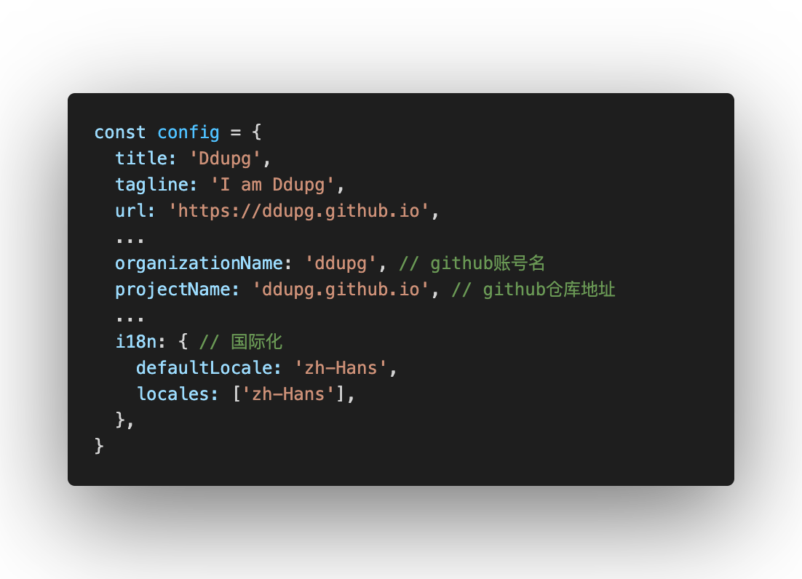
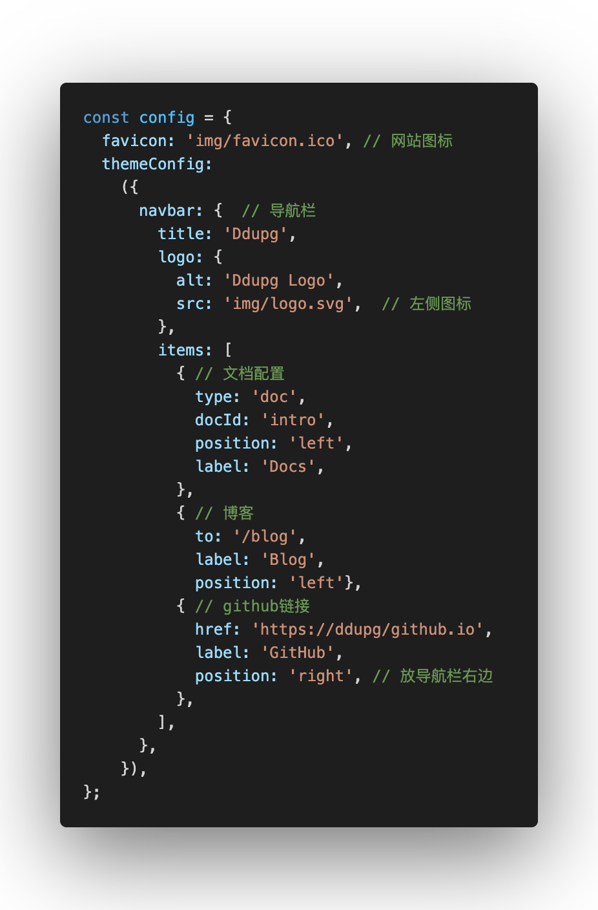
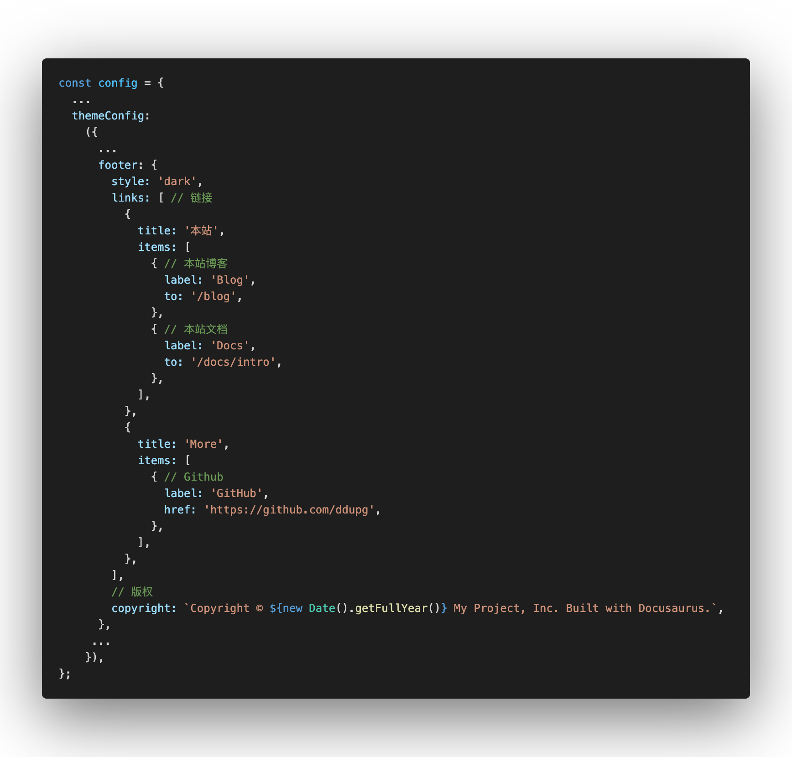

本想重做自己的博客和文档，本打算从头写，调研了Next.js和Gatsby，都是很强大的框架，但对我个后端开发来说还是很有难度的。无意中看到了Docusaurus框架，能自带文档和博客，还能高度自定义页面，完美匹配我的需求，所以就有了这个系列，打算记录下整个博客改造过程，能写几期不一定，慢慢来吧。

<!-- truncate -->

## 初始化项目

```
$ npx create-docusaurus@latest my-website classic --typescript
```

```
$ yarn
$ yarn build
$ yarn start # 开发过程中，能自动刷新
$ yarn serve # 不会自动刷新
```

## 修改网站配置

### 修改网站基本信息



### 修改图标&导航栏



制作图标过程中用到的几个工具，都是临时google找的：

[图片背景消除](https://www.remove.bg/zh)

[icon图标生成工具](https://www.logosc.cn/logo/favicon?s=d)

[PNG转SVG - 在线转换图像文件](https://www.aconvert.com/cn/image/png-to-svg/)

### 修改Footer

  

## 删掉自带的博客/文档Demo

博客目录：`blog/`
文档目录：`docs/`

文档目录只留个`intro.md`，因为配置里留了这个文件的引用，后面当个主页导航用。