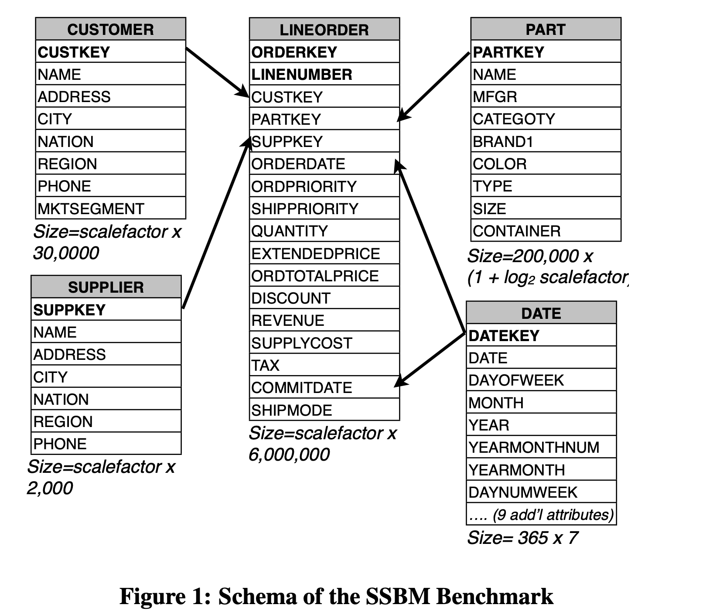
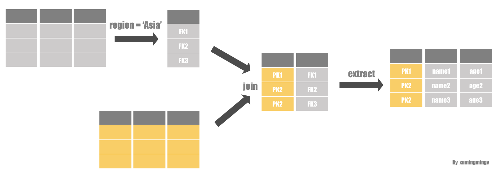
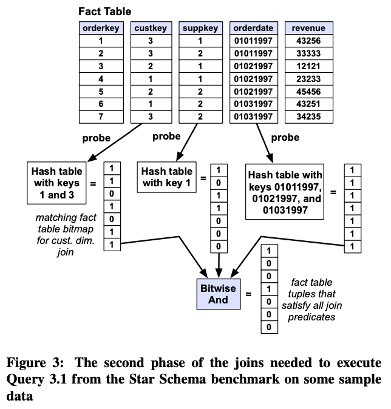
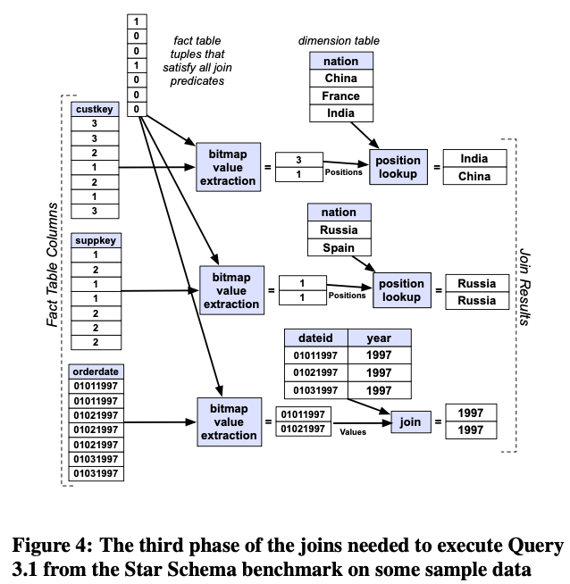
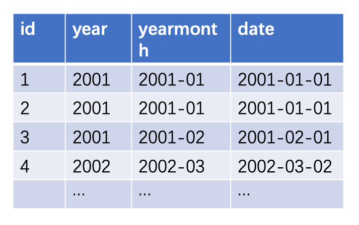
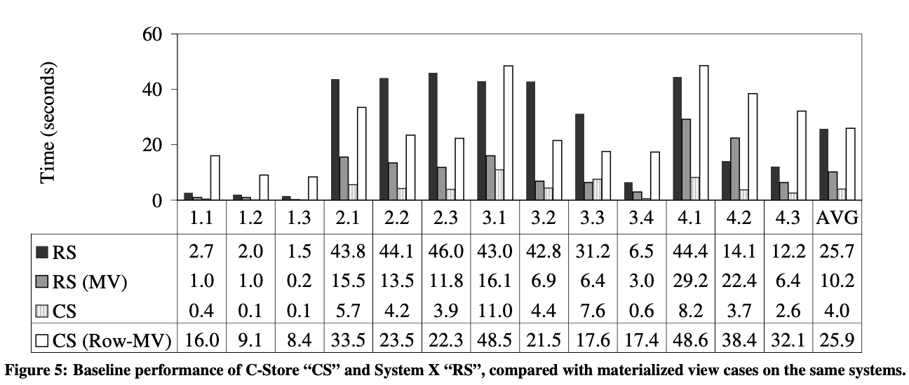
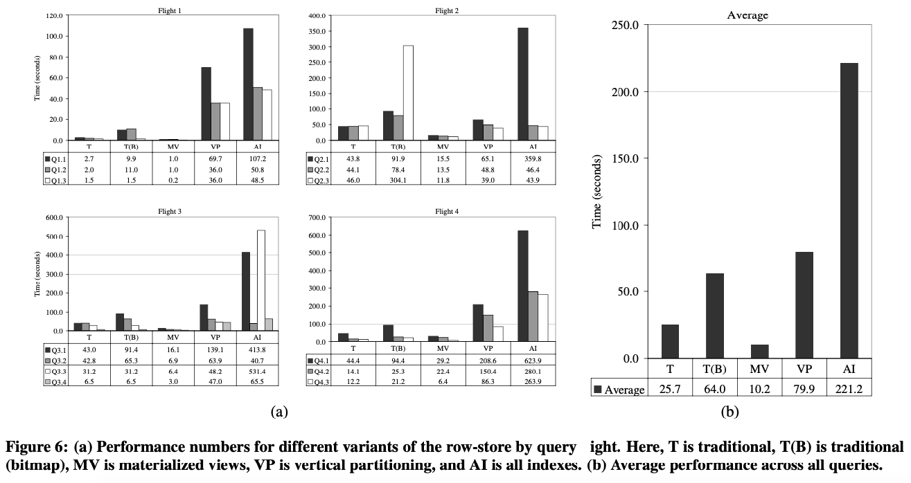
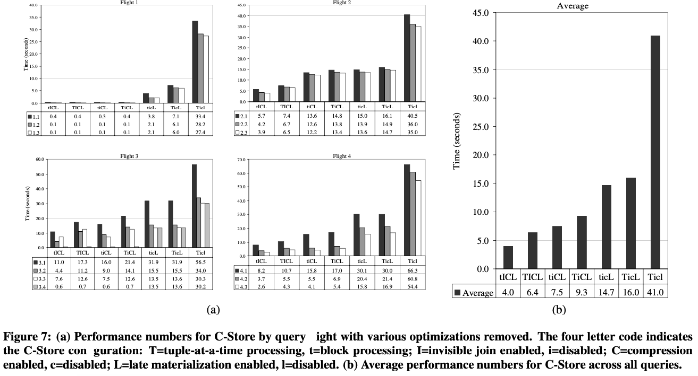
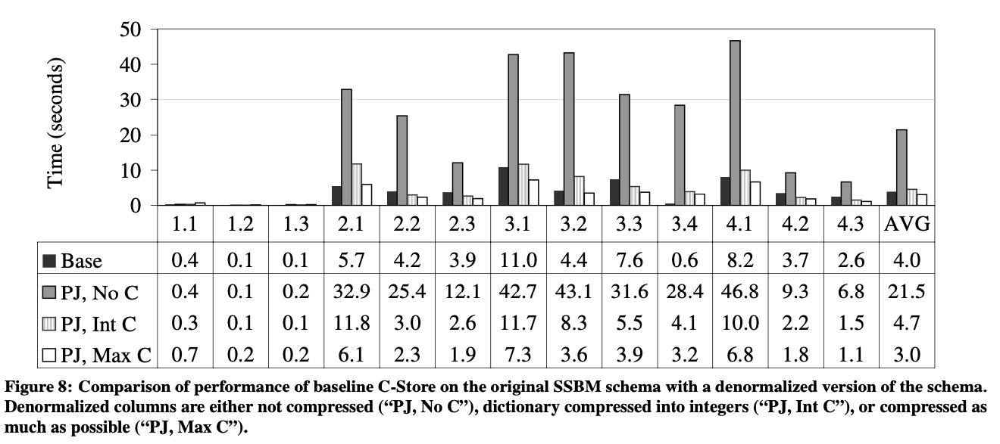

论文分享：Column-Stores vs. Row-Stores: How Different Are They Really?

## ABSTRACT

面向列设计的数据库系统已经被证明，在一些 data warehouse 场景下，比传统的行存数据库的性能要高一个数量级。原因很简单：**列存对只读查询的I/O效率更高，因为它们**只**从磁盘或内存中读**所需**的那些属性**。

**这种简单的认识导致了这样的假设，用行存也能获得列存的性能提升**：通过垂直划分schema，或者通过索引每一列以便可以独立访问列。**这篇论文就是为了证明这个假设是错的**。

我们将各种不同配置下的商业行存与列存的性能进行了比较，结果表明，在数据仓库基准测试中，行存储的性能明显更慢。然后我们分析了两个系统的性能差异，结果显示在***查询引擎层***存在很大差异（除了存储层的明显差异）。我们分别梳理了这些不同，发现各种**面向列的查询执行技术对性能的影响，包括向量化查询，压缩，和这篇论文中介绍的一种新的join算法**。所以我们推断一个行存系统不可能获得列存的性能提升，要想充分获得列存的优势必须对存储层和查询引擎同时修改。

****单单是存储层的不同不足以构成如此大的性能差异，更重要的是查询引擎层的优化。****

<!-- truncate -->

## 1. INTRODUCTION

事实上，描述面向列的数据库系统的论文通常包括性能展示，显示与传统面向行的数据库相比有如此的优势。虽然这样的结果证明了列存的潜力，但留下了一个关键问题：这些性能提升是因为DBMS内部**面向列**的基本设计吗？在传统行存系统中，使用一种更面向列的设计，是否有可能也可以获得性能提升呢？

论文中尝试了几种优化：

- **垂直划分系统中的表**，划分成一堆只有两列的表形成，以便只需要读取必要的列来响应查询。
- **索引方案**，创建一堆索引覆盖查询中的列，这样就有可能不用访问底层行存表直接响应请求了。
- 使用一堆**物化视图**，视图中恰好包含基准测试中查询所需的列。尽管这种方法使用了大量空间，但它是行存的“最佳情况”，并且提供了与列存实现的有用比较点。

我们将这些不同技术的性能和SSBM上开源的列存数据库的基准性能进行比较，结果显示，**尽管以上的方法能在行存中模仿列存的物理结构，它们的查询处理性能依然很差**。因此，**列存系统一定存在一些基础的设计让它们更适合用来做数据仓库**。然后引出了第二个问题：**在数据仓库的workload上，许多列存数据库特定优化中的哪一个最重要，对性能提升最大？**

先前的研究表明，面向列的DBMS的重要优化有：

- **延迟物化（Late materialization）**，在一个查询计划里，将从磁盘里读出来的列数据，尽可能晚的转成行。
- **块迭代（block iteration）**，一列中的多个值作为一个块从一个运算符传递到下一个运算符。如果value是固定长度的，就可以当作数组来迭代。
- **面向列的压缩技术**，像run-length encoding，当使用了延迟实现时，在压缩的数据上直接进行操作。
- 我们也提供了一种新的优化，加**invisible joins**，能提升late-materialization的列存上的join性能。

然而，因为这些技术每一项都是在单独的论文中描述的，没有工作分析哪项技术是最重要的。因此，这项研究的第三个贡献是：**通过在列存数据库里一个一个的去掉列存的优化技术，小心测试不同技术，分解导致它性能好的各项因素。我们发现，压缩可以有效降低数据量，但对其他方面受益不大，late materialization能有3倍的全面性能提升。其他优化——包括block iteration和我们新的invisible join技术，平均提供大约 1.5 倍的性能提升。**

总结下，这篇论文做了3项贡献：

1. 我们表明，在**行存系统中使用列存设计不会产生良好的性能结果**，并且通常被视为对仓库性能“良好”的各种技术（查询计划全部使用索引、位图索引等）也没什么作用。
2. 我们提供了一个新的技术来提升列存性能，叫**invisible joins**。我们通过实验证明，在许多情况下，在维表查询上效果不错。
3. 我们分解了列存性能的几个来源，**探索late materialization, compression, block iteration,和invisible joins对整体性能提升的贡献**。我们的结果证明，**没有压缩和延迟物化，简单的面相列的操作，并没有明显比优化较好的行存的设计好**。

## 4. BACKGROUND AND PRIOR WORK（背景和之前的工作）

在这一部分，简要介绍了列存储相对于传统行存储在性能方面的工作。总结就是，前人虽然有了一些想法或探索，但都成果有限。

虽然**对数据表进行垂直分区**来提高性能的想法已经存在很长时间了，MonetDB 和 MonetDB/X100 系统开创了现代面向列的数据库系统和向量化查询执行的设计。他们表明，面向列的设计——由于卓越的 CPU和缓存性能（除了减少 I/O）——可以在 TPC-H 等基准测试中明显优于商业和开源数据库。然而，MonetDB 的工作并没有尝试在行存系统中使用面向列的技术可能获得什么样的性能。

The fractured mirrors approach 是另一种最近的列存储系统，其中提出了**混合行/列**方法。 在这里，**行存主要处理更新，列存主要处理读取**，后台进程将数据从行存储迁移到列存储。这项工作还探讨了行存储 (Shore) 中完全垂直分区策略的几种形式，得出的结论是，原生scheme方案中的元组开销是一个重大问题，并且从磁盘预取元组的大数据块，能显著提升元组创建时间。

C-Store是最近的一个面向列的DBMS。它包含了很多和MonetDB/X100相同的特性，还有在压缩数据上直接进行操作的优化。和其他俩个系统一样，它也证明了在AP场景列存明显优于行存，但没有探索行存物理设计的设计空间。在本文中，我们剖析了 C-Store 的性能，并指出了文献中提出的各种优化对其整体性能做出的贡献，还有一些C-Store小组之前没有完成的工作。

Harizopoulos等人比较了从头开始构建的行存和列存的性能，研究了从磁盘扫描数据并立即构建元组（early materialization）的简单计划。这项工作表明，在简单的执行计划中，列存储的性能优于行存储，与它们从磁盘读取的列的比例成比例，但并未专门研究用于提高行存性能的优化，也没有研究某些提高列存储性能的先进技术。

Halverson 等人在 Shore 建立了一个列存实现，并将行存版本Shore与垂直分区版本的Shore进行了比较。他们的工作提出了一个优化，称为"超级元组"，避免重复的头信息，并将许多元组分在一个块中，这可以减少scheme完全垂直分区方案的开销，并且，对于本文中包含的基准，可以垂直制作分区数据库与列存储竞争。但是，那篇论文没有探讨最近许多面向列的性能优化。尽管如此，"超级元组"是本文需要添加到行存以模拟列存储性能的更高级优化。

## 3. STAR SCHEMA BENCHMARK（介绍SSBM测试基准）

在这篇论文，我们使用Star Schema Benchmark (SSBM)来比较C-Store和商业行存数据库的性能。

****SSBM使用了存粹的星形模型****（数据仓库最佳的数据组织形式）。

**Scheme**: 这个测试基准包含唯一一个事实表，按行排序（LINE-ORDER）的表，包含了TPC-H的LINEITEM和ORDERS表。这是一个包含订单信息的17列的表，由ORFERKEY和LINENUMBER属性组成的一个混合主键。LINEORDER 表中的其他属性包含CUSTOMER、PART、SUPPLIER和DATE表的外键引用，还有每个订单的属性，包括它的优先级、数量、价格和折扣。其他维表包含了它们各自的信息。Figure 1展示了这些表的scheme。

它有一个基本的"**规模因子**"，可用于缩放基准的大小。每个表的大小相对于此比例因子进行定义。本文使用的规模因子为10（产生具有 60,000,000 个元组的LINEORDER 表）。



**Queries：**SSBM包含4个种类共13个查询：

1. 第一种保护3个查询。查询对一维属性及LINEORDER表的DISCOUNT和QUANTITY有约束条件。查询衡量如果在给定年份过滤不同订单数量和各种折扣，会有多少收入（EXTENDEDPRICE和DISCOUNT的乘积）。3个查询的对LINEORDER表的选择率分别为1.9×10−2, 6.5×10−4, and 7.5×10−5。
2. 第二种包含3个查询。查询在2个维属性上有约束，按产品类型和年份分组计算特定地区特定产品类型的收入。对LINEORDER表的选择率分别为8.0×10−3, 1.6×10−3, and 2.0×10−4。
3. 第三种包含4个查询。在3个维属性上有约束。查询计算特定地区一段时间内的收入，按customer nation、supplier nation和年份分组。对LINEORDER表的选择率分别为3.4 × 10−2, 1.4 × 10−3, 5.5 × 10−5, and 7.6 × 10−7。
4. 第四种包含3个查询。查询在3个维度列上有限制，query 1按year、nation和category分组计算利润（REVENUE - SUPPLYCOST），query 2、3按nation、category分组。对LINEORDER表的选择率分别为1.6×10−2, 4.5×10−3, and 9.1 × 10−5。

**几类查询的区别就是有约束的维表数量不同，由少到多。每个分类中，有几个不同的查询，区别就是查询规模不同，数据的选择率不同，由多到少。**

## 4. ROW-ORIENTED EXECUTION（行存设计）

在这一节，我们要讨论几种可以在一个商业**行存DBMS（System X）中使用的列存设计的技术**。我们关注3个不同的设计：完全垂直分区设计、index only设计、物化试图设计。

**Vertical Partitioning：**在行存中使用列存最直接的方法就是完全垂直分区。为逻辑表中的每一列都创建一个实体表，第i个表有两列，一列是逻辑表第i列的值，第二列是主键。主键列用于join同一行的不同属性。我们尝试在每个表的position列上添加聚集索引，这并没有提高性能——索引访问引起的额外 I/O 使它们比hash join慢。

垂直分区方案有两个问题。第一，它要求在每个实体表里都要存储position列，会浪费空间和带宽。第二：大多数的行存系统会在每一个元组存储一个较大的header信息，会进一步浪费空间。

**Index-only plans：**第二个方法使用 *index-only plans*，逻辑表会按照标准的行存设计存储，然后每个表的每个列上都增加一个B+树的非聚集索引。尽管索引仍然显式存储主键，但它们不存储重复的列值，并且它们通常比垂直分区方法具有更低的元组开销，因为元组头没有存储在索引中。

**index-only方法有个问题是，回表操作慢**。因此，一个优化是创建使用复合键做索引。比如，如果执行`SELECT AVG(salary) FROM emp WHERE age>40`，就可以用(age,salary) 做**复合索引。主要是为了避免回表操作造成性能损失**。

**Materialized Views：**第三个方法我们考虑使用物化视图。对workload中的每一种查询，创建完美的物化视图，视图中只包含查询所需要的列。但它需要提前知道workload的各种query，所以只在有限的情况下使用。

## 5. COLUMN-ORIENTED EXECUTION（列存设计）

现在我们已经介绍了我们面向行的设计，这一节，我们回顾下列存数据库中常用的3种性能优化，并且介绍invisible join。

### 5.1 Compression（压缩）

**使用针对列的压缩算法，并在压缩的数据格式上直接进行操作，已经证明可以将查询性能提高一个数据量级**。直观地说，按列存储的数据比按行存错的数据更容易压缩。压缩算法在低信息熵的数据上表现更好。以包含客户信息（name, phone number, e-mail address, snail-mail address等）的数据库表为例。按列存储允许将所有的name存储在一起，将所有phone number存储在一起等。更进一步，如果在一列中的数据是有序的，就可以进行超级压缩（比如使用run-length编码对相同值进行压缩）。

但当然，上述观察只会立即影响压缩率。磁盘空间便宜，而且越来越便宜。然而**压缩在降低磁盘空间的同时也提高了性能，因为数据被压缩之后，当数据从磁盘读到内存时，花费在I/O上的时间更少了。然而，不能一味的追求压缩率，还需要在压缩率和解压速度之间做取舍。事实上，压缩可以提高查询性能，而不仅仅是节省 I/O。如果可以在压缩数据上直接进行操作，就可以完全避免解压，进一步提升性能**。例如像run-length编码。

先前的工作得出的结论是，行存压缩和列存压缩区别最大的情况是：列已经排序，并且有相同值连续重复。但对于我们在本文中使用的测试基准，我们不会以不同的排序顺序存储事实表的多个副本，因此事实表中只有 17 列中的一列可以排序（其他列进行二次排序），所以我们期望压缩不会有那么大的影响。

### 5.2 Late Materialization（延迟物化）

**在一个列存中，一个逻辑实体（比如一个人）的信息会被存储在多个位置，而行存中这些信息会被存储在表的一行里**。但是，大多数查询访问来自特定实体的不止一个属性。此外，大多数数据库输出标准（例如 ODBC 和 JDBC）访问数据库的输出是实体，而不是列。**因此，在大多数查询计划中的某个时刻，来自多个列的数据必须组合在一起，以“行”的形式组成有关实体信息**。因此，这种类似join的元组物化（materialization）是列存储中极其常见的操作。

原生的列存储将数据逐列存储在磁盘（或内存中），仅读取（从磁盘或内存到 CPU）与特定查询相关的那些列，构造成元组，在这些行上执行普通的行存储运算符（像select, aggregate, and join）来处理数据。尽管在数据仓库workload上可能仍然优于行存，但这种在查询计划中early materialization，使面向列的数据库的大部分性能潜力没有实现。

较新的列存储（例如 X100、C-Store 以及较小程度上的 Sybase IQ）选择**将数据按列的形式保留，直到查询计划进行的足够晚之后，直接对这些列进行操作**。为此，**通常需要构建中间的“position”列表以匹配已在不同列上执行的操作**。以一个查询为例，它在两列上使用过滤，并查出第三个属性。在使用延迟物化的列存中，过滤分布应用于每个属性的列上，并生成一个position（列中的相对偏移）列表。这个position列表可以表示为简单数组、bit string或者一些范围集合。然后将这些position列表做相交运算生成一个新的position列表，**如果是bitmap可以直接使用位与运算**。然后用这个列表从第三列提取所需位置的值。

优势有4点：

1. select和aggregate运算可能没必要构造某些元组，如果执行器等待最够长的时间，可能完全避免构造它。
2. 如果数据被压缩，则必须与其他列组合之前进行解压。这就丢掉了直接操作压缩数据的优势。
3. **Cache的利用率提高**，减少缓存不必要的数据。
4. 下一小节描述的**块迭代优化**对定长属性的性能影响很大。因为数据以Column形式保存在一起，数据是定长的可能性更大。过早物化，数据以Row的形式表示，数据定长的概率就大大降低。（比如数据定长可以并行计算）。

### 5.3 Block Iteration（块遍历）

为了处理一系列元组，行存储首先遍历每个元组，然后需要通过元组表示接口从这些元组中提取所需的属性。在许多情况下，例如在 MySQL 中，这会导致一次元组处理，其中有 1-2 个函数调用从每个操作的元组中提取所需的数据。

**列存中，如果列中数据是等宽的，这些值可以像数组迭代一样来处理（计算数组中位置，指针取值）。按数组操作数据不仅可以优化元组开销，还可以并行执行。**

### 5.4 Invisible Join

对数据仓库的查询，特别是对以星形建模的数据仓库的查询，通常是这样的结构：使用一个（或多个）维表上的过滤来限制事实表中的元组。 然后在事实表上执行一些聚合，通常按其他维表属性进行分组。因此，需要为每个选择谓词和每个聚合分组执行事实表和维度表之间的join。这是一个星形scheme查询的例子：


```
SELECT c.nation, s.nation, d.year, sum(lo.revenue) as revenue  // 收益求sum
FROM customer AS c, lineorder AS lo,
     supplier AS s, dwdate AS d
WHERE lo.custkey = c.custkey  // 事实表和3个维表的join条件
  AND lo.suppkey = s.suppkey
  AND lo.orderdate = d.datekey
  AND c.region = 'ASIA'  // Asia客户
  AND s.region = 'ASIA'  // Asia供应商
  AND d.year >= 1992 and d.year <= 1997 // 订单的时间在1992～1994年之间
GROUP BY c.nation, s.nation, d.year // 客户国家、供应商国和交易年份的分组
ORDER BY d.year asc, revenue desc;
```

#### 传统方案

传统方案是**按谓词的选择性优劣顺序来一次join**。

例如，如果`c.region = 'ASIA'`是选择性最好的谓词，那么lineorder和customer表上custkey的join就最先被执行，只剩下Asia用户的订单。执行这个join时，这些customer的nation就被添加到join后的用户订单表（中间表）了。再将结果表与supplier表的join，使用`s.region = 'ASIA'`谓词过滤。然后再同样的方法做year的谓词过滤。然后对这些join的结果进行分组和聚合，并将结果排序。


#### 延迟物化方案

传统计划的替代方案是**延迟物化**join技术。在这个例子中，`c.region = 'ASIA'`谓词执行时，customer表的主键也被提取，这些主键然后和事实表的外键列做join。**join的结果是两个position集合，一个用于事实表，一个用于维表。**

通常，两个position列表中**最多只有一个是有序的**。然后c.nation列的值和事实表其他列的值一起被提取。然后在再其他表上执行类似的join。



#### Invisible Join方案

每种计划都有一些列缺点：

1. **传统方案**：过早构造元组（early materialication），丧失了延迟物化的好处。
2. **延迟物化**：join时维表需要被无序提取，开销大。过早被提取的数据，可能最后发现是没有必要的。

论文中引入了一种新技术，叫invisible join，可在面向列的数据库中，适用于**星形表结构外键-主键join的情况**。这是一种延迟物化join，但**最小化了需要被无序提取的value数量**，因此可以减轻上述两组缺点。它会重写事实表外键列的join谓词。像_between-predicate rewriting_的技术，在5.4.2节讨论。

**核心的想法**：**通过将join重写成应用于事实表上的谓词，这样就可以使用谓词的优化算法，而且也可以并行执行谓词，最后用bitmap合并结果。等到所有谓词都执行完再进行元组提取，这样无序提取的数量就是最少的。**

#### *5.4.1 Join Details*

invisible join分3个步骤执行join。

**第一阶段，每个维表都应用与之相关的谓词，提取维表主键的列表**。这些主键用于构建一个hash表，用于判断一个特定的key value是否满足谓词（这个hash表应该很容易放进内存，因为维表通常很小并且hash表只包含主键）。Figure 2 表示在示例数据上执行上述第一阶段示例。

![[阅读/20221021-Column-Stores vs. Row-Stores How Different Are They Really?/figure4.png]]

**第二阶段，每个hash表用于提取事实表中记录的position**。这是通过在事实表的外键列中找寻hash表中的值，然后创建满足谓词的外键值的position列表。然后，**所有position列表做交集，生成事实表的position列表`P`** 。Figure 3是第二阶段的执行示例，注意position列表可能是一个明确的列表或者一个bitmap。



**第三阶段，就是在事实表上使用position列表`P`组装最终返回的元组**。使用P中的外键对维表进行取值，这里的外键可能有两种，一种是**维表的position**（常见情况，主键ID从1开始递增），另一种则是普通外键。如果是第一种情况，这意味着，可以使用position列表直接在所需的维表列中直接提取。

**整个查询的选择性决定了P的大小，P的大小决定了无序提取的数量**。

Figure 4是第三阶段执行的例子。请注意，对于date表，主键列不是从 1 开始的有序连续列表，因此必须执行完整连接（而不是位置提取）。此外注意，由于这是一个外键-主键的连接，并且由于所有谓词都已执行，因此P中的每个position在每个维表中都只且仅对应一个值。这意味着从第三阶段开始，每个维表join的结果数量相同，因此每个连接可以单独完成，结果在查询计划中较晚组合。



#### *5.4.2 Between-Predicate Rewriting（between谓词重写）*

正如目前所述，此算法只不过是另一种延迟物化的hash join的思维方式。尽管连接中的hash部分在事实表列上表示为谓词，但实际上，执行谓词的方式与执行（延迟物化）hash join的方式之间几乎没有区别。将join作为谓词表达的优势还体现在这种情况下：**应用了谓词的维表的keys连续的情况**。

前面讲到，维表与事实表join时，需要维护外键hash表来lookup查找事实表。如果**维表外键表示连续的一段key，那就把事实表上的lookup重写为"between"的谓词**。很明显，between谓词执行速度更快，因为可以直接判断，而无需任何查找。




```
SELECT sum(lo.revenue) as revenue FROM lineorder AS lo, dwdate AS d
WHERE lo.orderdate = d.datekey
  AND d.year = 2001
  
SELECT sum(lo.revenue) as revenue FROM lineorder AS lo, dwdate AS d
WHERE lo.orderdate = d.datekey
  AND d.yearmonth = '2001-01'
```

事实上，数据仓库中的维表包含越来越细粒度的属性集。例如，SSBM的date表，有year列、yearmonth列，和一个完整的date列。这个表按year、yearmonth、date三个列排序，结果都是一样的。类似的例子还有地区表（国家、省、市、区）。

数据仓库的查询经常访问这些列，而且OLAP的查询中，经常会有对属性不同层级进行类似的查询（按年月日分别计算收入，按省市区分别统计之类的），所以，**"between谓词重写"的使用频率可能超过最初预期，而且，通常会产生显著的性能提升**。

## 6. EXPERIMENTS（实验）

这一部分，比较行存系统和C-Store在SSBM基准测试中的表现。来回答以下4个问题：

1. 与C-Store的性能相比，在行存中使用的列存的几种尝试效果怎么样？
2. 未经修改的行存有没有可能获得面向列的设计的优点？
3. 几种优化方案（压缩、物化、块遍历），哪个是最重要的？
4. invisible join的性能怎么样？

我们所有的实验都是在 2.8 GHz 单处理器上运行的，双核奔腾 （R） D 工作站与 3 GB 的 RAM 运行 RedHat Enterprise Linux 5。该机器有一个4块盘， I/O 吞吐量为 40 - 50 MB/秒/磁盘。报告中的数据是几次运行的平均值。

### 6.1 Motivation for Experimental Setup



Figure 5 比较了C-Store和System-X 的性能。我们提醒读者不要过多地解读两个系统之间的绝对性能差异，除了影响这些性能的行与列的基本差异之外，这些系统的实现存在实质性的差异。

**RS表示行存系统，CS表示列存系统，MV表示使用了物化视图（只包含查询相关的列）**。

CS(Row-MV)比较特殊，是在列存中模拟行存，即整个表只有一列，这一列中的值是整行数据组成的string。

通过这种方式进行实验，无需依靠跨系统比较，我们就可以得出一些关于列存性能优势的结论。例如，有趣的是，图 5 中指出，**"CS"和"CS （Row MV）"之间有超过6倍的差异，尽管它们在同一系统上运行，并且都读取了回答每个查询所需的磁盘上最小列集。显然，列存储的性能优势不仅仅是从磁盘中读取较少数据的 I/O 优势**。

### 6.2 Column-Store Simulation in a Row-Store（在行存中模拟列存）

对System X进行了5种实验：

1. 传统方式。可以使用bitmap和bloom filters。
2. 传统方式（bitmap）。和传统方法类似，但偏向于使用bitmap。
3. 垂直分区方法。
4. index-only方法。在每个列上都使用B+树的非聚集索引，然后直接从索引中取值来响应请求。
5. 物化视图。只保留与请求相关的列。



Figure 6中可以看到，**物化视图的优化效果最好**。其次则是传统方案。

论文里分析了两个原因：

**Tuple overheads**：元组额外的开销。在垂直分区的方案中，事实表占用的空间扩大了4倍，IO开销大。

**Column Joins**：垂直分区后，不同列的值需要用主键合并到一起，这个过程是一次join，所以性能不好。

### 6.3 Column-Store Performance（列存性能）

这一节是为了解释列存为什么性能高，即对Figure 5中，CS(Row-MV)与CS两组实验的差异。

为了理解这组性能差异，我们在列存储中执行额外的体验，在此中，我们连续删除面向列的优化，直到列存开始模拟行存。在此过程中，我们了解了这些各种操作对查询性能的影响。

#### 6.3.1 Tuple Overhead and Join Costs_（列存可以避免元组开销和join开销）_

元组开销和Join开销是行存模拟列存中的两个性能损耗原因，但这在列存中并不存在。

**列存使用position来寻址数据，并不需要在每一列中维护主键等额外信息。同行的多列数据聚合也不需要join。**

#### 6.3.2 Breakdown of Column-Store Advantages（拆解列存的优势）

压缩、延迟物化、块遍历和invisible join都可以提升列存性能，我们通过在C-Store中一步步删掉这些优化，并测试性能。

1. 移除压缩很容易，只是一个flag参数。
2. 移除invisible join也很容易，因为这是我们新加的一个算子。
3. 移除延迟物化，就需要手动修改代码，在查询计划的开始位置就构造元组。
4. 移除块迭代是最难的。C-Store中block的访问接口有两种：getNext和asArray。前者是迭代每个value，后者就是返回一个可以迭代一个数组的指针。所以使用前者代替后者。



参数解释：

| 优化项                         | 大写        | 小写       |
| ------------------------------ | ----------- | ---------- |
| 块遍历，block processing       | T，元组迭代 | t，块迭代  |
| invisible join                 | I，enable   | i，disable |
| 压缩，compression              | C，enable   | c，disable |
| 延迟物化，late materialization | L，enable   | l，disable           |

- **块处理的性能提升只有5%～50%**。当压缩倍删掉之后，块处理的优势就没那么显著了。
- **invisible join可以提高50%～70%**。因为C-Store没有invisible join之前，用的是类似的延迟物化join，所以性能的差异主要是由于between谓词重写技术。在SSBM中，时间和地区两个维表都符合使用条件，而查询也都与这两个表相关，所以每个查询都会使用到between谓词重写技术。
- **压缩可以提高2倍性能**。但因为事实表不是按任意字段排序的，所以压缩的性能并没有发挥到极致。
- **延迟物化能提高3倍性能**。

最重要的两个优化是压缩和延迟物化。

请注意，一旦删除所有这些优化，列存就像是行存了。简单对比下几组数据，Figure 7中Ticl（去除所有优化的列存）与Figure 5中RS与CS(Row-MV)相比，性能更差。**说明没有优化的列存性能还不如行存。单单是存储层的不同不足以构成如此大的性能差异，更重要的是查询引擎层的优化。**

#### 6.3.3 Implications of Join Performance（join性能的影响）

研究中，发现join的性能影响很大。所以构造了一组没有维表只有事实表的测试，将维表中的数据，冗余的直接存储在事实表里。**虽然存储冗余数据会增加空间占用，但我们觉得避免了join可以加速查询**。

测试结果很意外。3个非维表化的版本与维表化的正常版本相比，性能居然更差。



Base：基本版本，有维表的版本。

PJ：没有维表的版本，将维表数据都冗余地加到事实表中，只有一个事实表。

- 第一组PJ测试，将nation这样的字符串字段，完整的保存到了事实表中，所以很多谓词优化都没法用。性能相较于Base组，差了4倍。
- 第二组PJ测试，**将nation这样的字符串字段进行字典编码成int字段**。这样性能就与Base组比较相近了，但在一些查询中还是比Base组差不少。原因有两个：

1. 一些查询中有两个谓词作用于同一个维表的情况，在Base组中，invisible join可以优化两个维表谓词变成一个事实表谓词，而PJ组只能对事实表做两次谓词查询。
2. 一些查询中有这样的情况：对维表的一列做谓词，对同一维表的另一列做group-by。这就需要对同一表访问两次。而C-Store的执行过程中，会将外键列缓存起来用于二次访问。而PJ的测试中，谓词列和group-by列，就只能分别访问两遍，造成两倍的IO。

- 第三组PJ测试，最大化压缩，比第二组的int压缩还小。在这组测试中，非维表化的性能才比Base要好一些。

这些测试结果很有意思。**长期以来，非维表化一直被当作提高查询性能的技术，增加冗余数据减少join次数来提高查询性能。本以为这种权衡（冗余和join）在列存中会更有优势，因为冗余并不算什么大问题。而测试结果却刚好相反：非维表化在列存（至少是星形scheme模型）中，不是很有用。事实上，只有当事实表中包含的维表属性被排序或者高度可压缩时，非维表化才有用**。

## 7. CONCLUSION

本文基于**SSBM基准**上C-Store的性能与行存系统的几个变体进行了比较。结果表明，试图通过垂直分区和仅索引计划等技术，**在行存中模拟列存的物理布局，但效果并不好**。我们解释了列存能够如此有效地处理以面向列的数据的原因，**发现延迟物化（late materialization）将性能提高了3倍，压缩平均提供大约 2 倍**。我们还支持一种新的连接技术，称为**invisible join，进一步提高性能约50%**。


这个工作并不是说在行存中模拟列存是不可能的，而是，在如今的行存系统中这么做表现并不好。

## 参考

- [原论文](http://www.cs.umd.edu/~abadi/papers/abadi-sigmod08.pdf)
- [《Column-Stores vs. Row-Stores》读后感](https://zhuanlan.zhihu.com/p/54433448)
