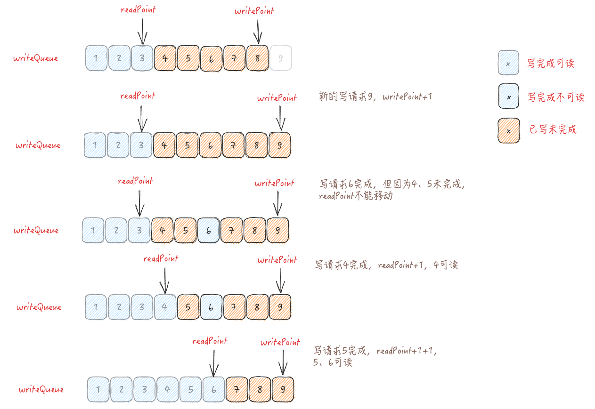

现代数据库中，为提高并发行能，对于读写冲突，往往避免采用全程加锁的方案，而采用MVCC多版本并发控制。

本文简单介绍下HBase的MVCC的实现机制。

<!-- truncate -->

## MVCC基本结构

HBase的MVCC是由`MultiVersionConcurrencyControl`类实现。

```java
public class MultiVersionConcurrencyControl {  
  
  final AtomicLong readPoint = new AtomicLong(0);
  final AtomicLong writePoint = new AtomicLong(0);
  // This is the pending queue of writes.
  private final LinkedList<WriteEntry> writeQueue = new LinkedList<>();

}
```

关键属性就这么多。语言描述太麻烦，直接看图。



**HBase的MVCC维护的可读范围是连续区间，没有空洞**。图中6先于4、5完成但不可读。直到4、5都完成时，会连续更新`readPoint`到6，6才可读。

```java
public static final class WriteEntry {
  // 从writePoint中取的值
  private final long writeNumber;
  // 当前entry是否已经完成
  private boolean completed = false;
}
```

`WriteEntry`也很简单，不废话。

## MVCC 初始化

HBase的事务只做到region级别，原生不支持跨region的事务。所以每个Region持有一个MVCC对象来做版本控制。

在region初始化时，会从region的数据目录下加载所有的HFile以及recoverd edits/hfiles，找到最大的seqId，用来初始化MVCC的`readPoint`和`writePoint`。

```java
// 初始化所有Store，返回的是所有Store中所有HFile的seqId最大值
long maxSeqId = initializeStores(reporter, status);
this.mvcc.advanceTo(maxSeqId);
if (!isRestoredRegion && ServerRegionReplicaUtil.shouldReplayRecoveredEdits(this)) {  
  Collection<HStore> stores = this.stores.values();  
  try {
    ...
    // Recover any edits if available.
    // 恢复recovered edits，更新maxSeqId
    maxSeqId = Math.max(maxSeqId, replayRecoveredEditsIfAny(maxSeqIdInStores, reporter, status));
    // Recover any hfiles if available
    // 恢复recovered hfiles，更新maxSeqId
    maxSeqId = Math.max(maxSeqId, loadRecoveredHFilesIfAny(stores));  
    // Make sure mvcc is up to max.
    this.mvcc.advanceTo(maxSeqId);  
  }
  ...
}
```

### region的seqId是什么

region的每个Cell都有个seqId，由MVCC生成的不断递增的整型。同一个事务中的Cell具有相同的seqId。

1. 如果是新表的空region，seqId则从1开始生成
2. 如果是已存在的region，在重新open的时候，则需要通过读HFile和recovered edits/hfiles获知当前最大的seqId，再继续递增。
3. 其中split/merge产生的region，也会找到split/merge之前的region的HFile最大的seqId，即子region会在父region的seqId基础上继续递增。

## 写请求

Region的写操作，都会收敛到`doMiniBatchMutate()`方法，所以直接来看这里的逻辑

```java org.apache.hadoop.hbase.regionserver.HRegion#doMiniBatchMutate
private void doMiniBatchMutate(BatchOperation<?> batchOp) throws IOException {
  ...
  // STEP 3. Build WAL edit
  // 对于正常的写入操作，walEdits只有一个元素
  List<Pair<NonceKey, WALEdit>> walEdits = batchOp.buildWALEdits(miniBatchOp);  

  // STEP 4. Append the WALEdits to WAL and sync.
  for (Iterator<Pair<NonceKey, WALEdit>> it = walEdits.iterator(); it.hasNext();) {
    ...
    if (walEdit != null && !walEdit.isEmpty()) {
      // 把修改追加写到WAL中，在这里面会调用到mvcc.begin()，并将writeEntry最终返回
      // 在这里面，会把WALEdit中所有的Cell的seqId设置成writeEntry的writePoint
      writeEntry = doWALAppend(walEdit, batchOp, miniBatchOp, now, nonceKey);
    }

    // Complete mvcc for all but last writeEntry (for replay case)
    if (it.hasNext() && writeEntry != null) {
      // 因为walEdits只有一个元素，所以不会执行到这里
      mvcc.complete(writeEntry);  
      writeEntry = null;  
    }
  }

  // STEP 5. Write back to memStore
  // NOTE: writeEntry can be null here
  writeEntry = batchOp.writeMiniBatchOperationsToMemStore(miniBatchOp, writeEntry, now);

  // STEP 6. Complete MiniBatchOperations: If required calls postBatchMutate() CP hook and  
  // complete mvcc for last writeEntry
  // 这里会执行mvcc.completeAndWait(writeEntry)
  // 标志writeEntry完成，并阻塞到writeEntry之前的所有entry完成，实际就是阻塞到当前事务可见
  batchOp.completeMiniBatchOperations(miniBatchOp, writeEntry);
}
```

为介绍简单，省略了大部分细节。总结下上面的写入流程：
1. 根据写入内容，构造WAL中的WALEdit
2. 写WAL，在必要的时候通过region的MVCC生成writeEntry，并填充Cell的seqId
3. 把变更内容写进MemStore
4. 阻塞等待当前事务的writePoint可见，代表事务完成

这时候再来看下MVCC的两个核心方法怎么实现的：

`begin()`开启一个写事务
```java org.apache.hadoop.hbase.regionserver.MultiVersionConcurrencyControl#begin
public WriteEntry begin(Runnable action) {
  // 对writeQueue上锁
  synchronized (writeQueue) {
    // writePoint递增，生成新的WriteEntry，并加入到writeQueue中
    long nextWriteNumber = writePoint.incrementAndGet();
    WriteEntry e = new WriteEntry(nextWriteNumber);
    writeQueue.add(e);
    // 为理解简单，忽略这里的Runnable就好
    action.run();
    return e;
  }
}
```

`complete()`完成一个事务

```java org.apache.hadoop.hbase.regionserver.MultiVersionConcurrencyControl#complete
public boolean complete(WriteEntry writeEntry) {
  // 对writeQueue上锁
  synchronized (writeQueue) {
    // 标记当前writeEntry完成
    writeEntry.markCompleted();
    long nextReadValue = NONE;
    boolean ranOnce = false;
    while (!writeQueue.isEmpty()) {
      ranOnce = true;
      // 取出writeQueue的头节点
      WriteEntry queueFirst = writeQueue.getFirst();
      ...
      // 如果头节点已经完成，则从队列中移除
      if (queueFirst.isCompleted()) {
        nextReadValue = queueFirst.getWriteNumber();
        writeQueue.removeFirst();
        queueFirst.runCompletionAction();
      } else {
        break;
      }
    }
    ...
    if (nextReadValue > 0) {
      synchronized (readWaiters) {
        // 更新readPoint
        readPoint.set(nextReadValue);
        // 唤醒可能在等待事务完成的线程
        readWaiters.notifyAll();
      }
    }
    // 当前的事务可读了，返回true
    return readPoint.get() >= writeEntry.getWriteNumber();
  }
}
```

## 读请求

region读数据都会最终构造成`RegionScannerImpl`执行，我们直接看`RegionScannerImpl`的构造方法。

```java org.apache.hadoop.hbase.regionserver.RegionScannerImpl#RegionScannerImpl
RegionScannerImpl(Scan scan, List<KeyValueScanner> additionalScanners, HRegion region,
long nonceGroup, long nonce) throws IOException {
  this.region = region;  
  ... 
  IsolationLevel isolationLevel = scan.getIsolationLevel();  
  // 从scan信息中读readPoint。因为scan可能跨越多次rpc，为保证每次的可见性一致，会在scan里记录readPoint
  long mvccReadPoint = PackagePrivateFieldAccessor.getMvccReadPoint(scan);  
  ...
  try {
    if (mvccReadPoint > 0) {
      // 如果scan里有readPoint，则直接使用
      this.readPt = mvccReadPoint;
    } else if (hasNonce(region, nonce)) {
      // 忽略，正常读请求不会走到这
    this.readPt = rsServices.getNonceManager().getMvccFromOperationContext(nonceGroup, nonce);
    } else {
      // 根据隔离级别，获取readPoint
      this.readPt = region.getReadPoint(isolationLevel);
    }
    ...
  }
  ...
}
```

`RegionScannerImpl`会层层分拆为读MemStore的`SegmentScanner`和读HFile的`StoreFileScanner`，`readPt`参数也会一直传递下去。

```java org.apache.hadoop.hbase.regionserver.SegmentScanner#updateCurrent
/**  
* Private internal method for iterating over the segment, skipping the cells with irrelevant MVCC  
*/  
protected void updateCurrent() {  
  Cell next = null;
  ...
    while (iter.hasNext()) {  
      next = iter.next();
      // 只有<=readPoint的Cell才会被读到
      if (next.getSequenceId() <= this.readPoint) {
        current = next;
        return;// skip irrelevant versions
      }
      ...
    } // end of while
  ...
}
```


```java
protected boolean skipKVsNewerThanReadpoint() throws IOException {  
  // We want to ignore all key-values that are newer than our current
  // readPoint
  // 跳过所有>readPt的Cell
  while (enforceMVCC && cur != null && (cur.getSequenceId() > readPt)) {
    boolean hasNext = hfs.next();  
    setCurrentCell(hfs.getCell());  
    ...
  }
  ...
}
```

通过以上两段代码，可以看出scan操作只会返回<=readPoint的Cell

## 总结

- HBase的版本MVCC比较简单，只支持Region级别的事务，事务可见范围只有从(-∞, readPoint]的单段区间
- 写操作执行前申请WriteEntry，执行完成后，等待WriteEntry可见，以此保证强一致性
- 读操作则根据readPoint，过滤掉所有不可见的Cell即可
