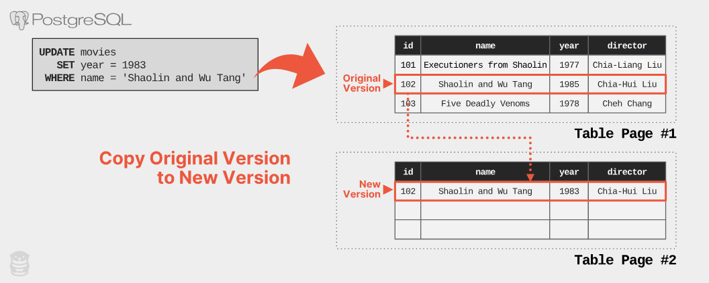

最近学习了MySQL的MVCC实现，然后看到了这篇博客详细介绍了PG MVCC的实现，以及这种实现有哪些问题。既能深入理解数据库MVCC实现基本原理，也能对比MySQL和PG的MVCC实现，理解为什么PG的MVCC深受吐槽，所以翻译了这篇文章。

<!-- truncate -->

[原文链接](https://ottertune.com/blog/the-part-of-postgresql-we-hate-the-most/)

当前有大量的数据库可供选择（到2023年4月有897个）。在2000年代，最普遍的选择是MySQL。最近5年，PostgreSQL成为互联网上最受欢迎的数据库。因为它可靠，有丰富的feature，可扩展，适合大多数工作负载。

尽管PostgreSQL很受欢迎，但它有些方面还不是很好。这篇博客想讨论下一个很严重的问题：PostgreSQL怎么实现MVCC（多版本并发控制）。我们在卡耐基梅隆大学的研究，以及对Amazon RDS上PostgreSQL数据库实例的优化经验表明，它的MVCC实现是主流数据库（MySQL、Oracle、Microsoft SQL Server）中最差的。并且，Amazon的Aurora也有这些问题。

在这篇文章中，我们深入MVCC：

- MVCC是什么？
- PostgreSQL怎么实现的？
- 为什么很糟糕？

## 什么是MVCC？

在DBMS中MVCC的目的是允许读和写并行执行而尽可能不会相互干扰。MVCC的基本思路是不会覆盖写入已经存在的行。对每一（逻辑上的）行，维护多个版本。当应用执行一个查询，DBMS根据版本号（像时间戳）选择适合当前查询的版本。这个方法的优点是多个查询可以同时读更老版本的数据，而不会阻塞更新。查询观察到的是DBMS开启事务时的快照（快照隔离）。这个方法不需要在更新时增加行锁去堵塞对相同行的读请求。

我们认为1978年David Reed的 [Concurrency Control in Distributed Database Systems](https://dspace.mit.edu/handle/1721.1/16279) 是第一篇描述MVCC的出版物。1980年代，[InterBase](https://en.wikipedia.org/wiki/InterBase#History)是第一个使用MVCC实现的商业DBMS。从这之后，几乎近20年诞生的支持事务的DBMS都实现了MVCC。

当实现一个支持MVCC的DBMS时必须做几个设计决策。从较高的层面来看，它可以归结为以下几点：

1. 对已经存在的行，怎么存储对它的更新
2. 对查询来说，怎么找到一行数据的正确版本
3. 怎么删除不再可见的过期版本

这些决策并不互斥。在PostgreSQL的例子中，他们在1980年代解决第一个问题的方式导致我们今天仍需解决其他两个问题。

之后的讨论我们使用下面这个例子：一张电影信息表。表中的每行数据包含电影名、发布年份、导演、和一个唯一ID作为主键，以及在电影名和导演字段上建立二级索引。下面是这个表的DDL命令。

```SQL
CREATE TABLE movies (
  id INTEGER PRIMARY KEY GENERATED ALWAYS AS IDENTITY,
  name VARCHAR(256) NOT NULL,
  year SMALLINT NOT NULL,
  director VARCHAR(128)
);
CREATE INDEX idx_name ON movies (name);
CREATE INDEX idx_director ON movies (director);
```

这个表包含一个主键索引 `movies_pkey` 和两个B+树的二级索引 `idx_name`, `idx_director`

## PostgreSQL 的 MVCC

PostgreSQL自设计之初就支持多版本。PostgreSQL MVCC的核心思想很直接：当更新已经存在的行时，对行数据做一份拷贝，并将更新应用到拷贝后的版本上，而不是在已有行上覆盖更新。我们称这种方式为`append-only`的版本存储方式。但这个方法对系统的其余部分有一些重要的影响。

### 多版本的存储方式

PostgreSQL在相同的存储空间中存储表的所有版本数据。为了更新已经存在的tuple，DBMS首先为新版本申请一个空的slot。然后拷贝当前版本的行数据作为新版本，再应用更新到新版本中。你可以在下面的例子中看到这个过程，



现在对于一个逻辑行已经存在两个版本，DBMS需要记录这些版本的关系，以便之后查询。DBMS通过一个基于单向链表的版本链来实现这个目的。版本链只能按一个方向去迭代以减少存储和维护开销。这意味着DBMS必须决定使用哪个顺序：*newest-to-oldest*（N2O）或者*oldest-to-newest*（O2N）。

> 版本链的存储方式是单向链表，只能按一个方向迭代查找。

对于N2O顺序，每个tuple版本指向它的前一个版本，版本链的头节点总是最新的版本。对于O2N顺序，每个tuple版本指向它的新版本，并且头节点是最老的tuple版本。O2N方法避免了在每次修改的时候还要去更新索引使其指向新版本。

然而，在查询时为了找到最新版本可能要花很长时间在版本链上迭代。大多数的DBMS，包括Oracle和MySQL都是N2O实现。但PostgreSQL仍然使用O2N。

> O2N的方式，通过索引找到旧版本，再通过版本链找到合适的新版本。
> 所以数据更新如果不涉及索引字段变化，可以不用更新索引。但代价就是使用索引的查询效率更低。

下一件事是PostgreSQL在版本指针里记录了什么。每行记录的header包含一个tuple id字段（t_tcid）指向下一个版本（如果它自己就是最新版本则指向它自己）。因此，像下面例子展示的，当查询一行记录最新版本的数据时，DBMS需要根据索引，加载最老的版本，然后沿着指针迭代找到它需要的版本。


PostgreSQL的开发者很早就意识到MVCC设计的两个问题。首先，每次更新都拷贝整个tuple很昂贵。第二，查询最新版本要迭代整个版本链代价也很高。

为了避免迭代整个版本链，PostgreSQL的索引为一行数据的每个版本都添加一条记录。这意味着如果一个逻辑行有5个版本，索引中就会有5条记录。在下面的例子中，我们看的索引`idx_name`包含一条记录的两个版本，分散在两个page中。这使得可以直接访问最新版本的tuple，而不用迭代整个版本链。


PostgreSQL使用 [heap-only tuple (HOT)](https://www.postgresql.org/docs/current/storage-hot.html) updates技术，将新版本的拷贝放到和旧版本同一个page中，避免去更新多条索引记录和跨page存储多个相关版本的数据，以此减少磁盘IO。如果更新字段不涉及索引相关的列，并且旧版本所在的page有足够的空间，就可以使用HOT方式优化。在我们的例子中，在更新后索引仍然指向旧版本，查询请求通过迭代版本链获取最新版本。正常操作期间，PostgreSQL通过删除旧版本来优化查询。

> 为了加速索引查询效率，修改时也在索引中增加指向新版本的记录。但每次都更新索引代价也高，所以提出HOT update技术，如果修改不涉及索引字段变化，且新旧版本仍然在同一个page中，就不去更新索引。
> 我觉得这种方案的考虑可能是：在一个page中迭代版本链是内存操作速度快，但如果新旧记录跨page，就会涉及一次磁盘随机IO，通过索引找到旧版本，再迭代版本链找新版本，那何不直接由索引指向新版本，节省跨页时的磁盘IO。

### 版本清理

我们已经确定PostgreSQL在更新时会产生新的版本。下一个问题是怎么回收无效版本。在PostgreSQL的早期版本中并不清理无效版本。想法是存储所有的历史版本，允许应用查询任意时间点的数据。但不清理无效版本意味着表空间不会收缩。也意味着频繁更新tuple的长版本链，这会降低查询速度。除非PostgreSQL的索引可以直接找的正确的版本而不用迭代版本链。但这又意味着索引会变大，降低查询速度，增加存储压力。你现在明白为什么这些问题都是相互关联的了吧。

为了解决这些问题，PostgreSQL使用了vacuum来清理表中无效的tuple。vacuum会顺序扫描表的数据页找过期版本。一个版本，如果没有存活的事务可见，就会被认为是过期版本。这意味着当前没有事务正在访问这个版本，之后的事务也会访问更新的版本。因此删除过期版本并回收空间是安全的。

PostgreSQL按照配置的固定时间间隔，自动执行vacuum（autovacuum）。除了有影响所有表的全局配置之外，PostgreSQL还提供表级别的配置。用户也可以通过`VACUUM`命令手动触发。

## 为什么PostgreSQL的MVCC是最糟糕的

老实说：如果今天有人要实现一个MVCC的MBMS，他们不会采用PostgreSQL的方式实现。在我们的这篇论文里 [2018 VLDB paper](https://db.cs.cmu.edu/papers/2017/p781-wu.pdf) (aka “[the best paper ever on MVCC](https://twitter.com/andy_pavlo/status/902863242774634496)“)，我们没有找到其他DBMS像PostgreSQL一样实现MVCC。它的设计是1990年代日志结构系统爆发前，1980年代的遗迹。

让我们讨论PostgreSQL MVCC的4个问题。我们也会讨论为什么其他MVCC的DBMS，像Oracle、MySQL避免了这些问题。

### 问题 #1: 版本拷贝

在append-only的存储模式中，如果更新一个tuple，无论修改多少列，DBMS都会拷贝所有的列作为新版本。可以想象，append-only的MVCC会导致大量数据重复和存储需求增加。这个方法意味着PostgreSQL比其他DBMS需要更多的内存和磁盘，意味着更慢的查询和更高的云成本。

相比于拷贝整个tuple作为新版本，MySQL和Oracle存储的是新版本和当前版本的差异（文章中用的是‘delta’）（就像git diff）。如果一个请求只更新了一张1000列的表中的一列，PostgreSQL需要创建一个新版本，包含修改的1列和未修改的999列。而MySQL这类DBMS只需要记录更新的这一列的差异。

> 这种方式文章中成为delta versions。后面也直接用这个词。

为了让PostgreSQL的多版本存储更现代化，EnterpriseDB在2013年开始了[zheap project](https://wiki.postgresql.org/wiki/Zheap)，尝试使用delta versions的方式替换append-only的存储引擎。遗憾的是失败了。

### 问题 #2: 表膨胀

PostgreSQL过期版本数据相对于delta versions的方式，会占用更多的存储空间。尽管PostgreSQL的自动清理最终会删掉无效tuple，但写压力大的场景下可能会导致数据增长比清理速度更快，导致数据库的持续增长。因为DBMS把无效tuple和存活tuple混合存储在page中，查询时必须把过期tuple也加载进内存。

无限的膨胀会增高IOPS并且消耗更多内存，最终降低查询性能。另外，由无效tuple引起的不准确的优化器统计信息可能会导致糟糕的查询计划。

假设我们的电影表有1000万有效tuple，4000万无效tuple，有80%的无效数据。而且表中列较多，平均每个tuple占用1KB。这种场景下，有效tuple占用10GB存储空间，无效tuple占用40GB空间，整个表占用50GB。

当一个查询执行全表扫描，PostgreSQL必须从磁盘加载50GB数据，并且存储在内存中，尽管大多数数据是无效数据。尽管PostgreSQL有保护机制避免顺序扫描污染缓存池，但也不能避免IO消耗。

尽管你可以确定PostgreSQL的自动清理正在周期性执行并且能跟得上你的workload（本身并不容易），自动清理也无法回收存储空间。自动回收会删除每个page上的无效tuple，并且重新存储存活tuple，但他也不会回收磁盘上的空page。

> 这里的空page只是DBMS逻辑上的空page，像是文件中的空闲区域，仍然受DBMS管理，在后续分配时使用。
> 而返还OS得对文件重写。

在我们上面的例子中，即使PostgreSQL从电影表中删掉了40GB的无效tuple，它仍然会保留从操作系统申请的50GB存储空间（AWS的RDS就是这个情况）。为了回收这些无用空间，必须使用`VACUUM FULL`或pg_repack去重写整个表到一片新空间。

在不考虑生产数据库的性能影响的情况下，运行这两种操作都不是一件容易的事。它们是耗资源且耗时的操作，会拖垮查询性能。下图展示了`VACUUM`和`VACUUM FULL`如何工作


当PostgreSQL执行`VACUUM`操作，DBMS只是从表的page中删掉无效tuple，然后重新组织，将所有有效tuple放到page的末尾。而执行`VACUUM FULL`，PostgreSQL从每个page中删掉无效tuple，重新合并所有剩余存活tuple到一个新的page中(Table Page #3)，并且删掉无用的page(Table Pages #1 / #2)

### 问题#3: 二级索引的维护

对一个tuple的一次更新，PostgreSQL要更新表的所有索引，因为PostgreSQL在主键索引和二级索引中存储的都是一个版本的物理地址。除非新版本和旧版本在同一个page上（HOT update），否则就要更新所有索引。

回到我们`UPDATE`请求的例子，PostgreSQL在一个新的page上创建了旧版本的拷贝形成新版本。但它也需要在主键索引（movies_pkey）和2个二级索引（idx_director，idx_name）中插入指向新版本的记录。


在上图的例子中，展示非HOT update操作时索引的维护。DBMS在Page#2上创建了tuple的一个新版本，然后在表的所有索引中插入一条新纪录指向这个版本。

每次更新都要修改表的全部索引会带来性能损耗。DBMS增加了额外的I/O去读写每个索引。访问索引也会在索引和DBMS内部数据结构上引入锁竞争（例如buffer pool的page table）。

另外，对索引的维护工作带来的额外读写对于基于IOPS向用户收费的DBMS是有问题的，像Amazon Aurora。

根据上面描述的，PostgreSQL通过将新版本与旧版本写在同一个page上（HOT update）来避免更新索引。我们基于OtterTune用户的PostgreSQL数据库分析平均大约46%的更新使用了HOT update。仍然有超过50%的更新要付出这个代价。

有很多用户例子挣扎于PostgreSQL的MVCC实现的。最著名是Uber 2016年的博客，关于他们[为什么从Postgres迁到了MySQL](https://www.uber.com/en-HK/blog/postgres-to-mysql-migration/)。他们写密集型的workload，在一些有较多二级索引的表上，有严重的性能问题。

Oracle和MySQL在他们MVCC的实现上没有这个问题，因为他们的二级索引不是存储的新版本的物理地址。相反，他们存储了一个逻辑ID（例如 tuple id，主键ID）。这可能会导致读二级索引更慢，因为必须要解析逻辑ID（回表），但这些DBMS在他们MVCC的实现上有其他优势来降低损耗。

### 问题 #4: Vacuum management

PostgreSQL的性能严重依赖autovacuum删除过期数据并回收空间的效率。无论你正在使用的是RDS，Aurora或者Aurora Serverless，所有基于PostgreSQL的变体都有一样的autovacuum问题。

但是因为其复杂度，很难确保autovacuum可以最佳地运行。PostgreSQL对优化autovacuum的配置并不适合于所有表，尤其是大表。例如，默认autovacuum触发前，更新操作占比至少20%([autovacuum_vacuum_scale_factor](https://www.postgresql.org/docs/15/runtime-config-autovacuum.html#GUC-AUTOVACUUM-VACUUM-SCALE-FACTOR))。这个阈值的意思是，如果一张表里有1亿tuple，在更新至少2千万前不会触发autovacuum。因此，PostgreSQL可能保存了大量无效tuple很长时间，这会增加IO和内存消耗。

PostgreSQL autovacuum的另一个问题是，它可能被长时间运行的事务阻塞，这会导致更多无效tuple的积累和过时的统计数据。未能及时清理过期版本会导致更严重的性能问题，导致更多长时间运行的事务阻塞autovacuum执行。这变成一个恶性循环，要求手动kill掉长时间运行的事务。

下图展示了一个OtterTune客户的数据库中，两周内无效tuple的数量：


PostgreSQL Amazon RDS 数据库中一段时间​​内失效tuple的数量。

图中的锯齿状表示autovacuum大约每天执行一次major clean-up。例如，在Feb-14th，DBMS清理了320万的无效tuple。这个图展示的，就是一个不健康的PostgreSQL数据库的例子，因为autovacuum赶不上无效tuple增长的速度。

在OtterTune，我们经常在用户的数据库中碰到这个问题。一个 PostgreSQL RDS 实例由于批量插入数据后，过时的统计信息导致查询长时间运行。此请求阻塞autovacuum更新统计信息，导致了更多长时间运行的请求。这就需要管理员手动kill掉请求。

> 根据上文描述，这里的统计信息（statistics）应该是指查询优化器的统计信息，查询优化器统计信息不准，导致查询计划不合理，事务运行时间更长。

## 结束语

构建 DBMS 时总是必须做出一些艰难的设计决策，这些决定将导致任何 DBMS 在不同的工作负载上表现不同。对于Uber这类写密集型workload，由于PostgreSQL MVCC带来的索引写放大问题，就是他们迁移到MySQL的原因。

但请不要误解我们的谩骂意味着我们不认为你应该用PostgreSQL。尽管它的MVCC实现采用了错误的方式，PostgreSQL仍然是我们最喜欢的DBMS。热爱某件事就是愿意克服它的缺陷。

所以如何解决PostgreSQL的问题？你可能会花费大量的时间和精力自己调整它。[祝你好运](https://philbooth.me/blog/nine-ways-to-shoot-yourself-in-the-foot-with-postgresql)。

[下一篇博客](https://ottertune.com/blog/yes-postgresql-has-problems-but-we-re-sticking-with-it)我们会详细介绍你可以做哪些事情。
