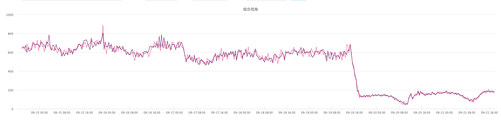
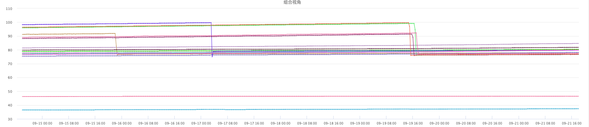
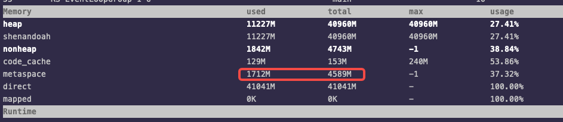
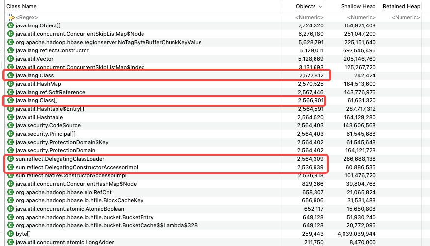

公司的HBase集群偶尔有个很奇怪的现象：内存占用会逐渐升高，超过堆内堆外内存限制，直到把操作系统内存占满被oom-killer杀死。在内存占用逐步升高的期间，响应延迟越来越高，最终服务宕机也会造成集群抖动，影响SLA。

内存增长过程非常缓慢，大概一两个月宕机一次。之前一直苦恼于没有现场，这次终于抓到了一个稳定复现的集群。

目前还没正式修复，修复验证也要几周时间，所以等我验证后再补充效果。

<!-- truncate -->

## 现象

用户反馈集群的延迟远高于其他集群，之前SRE进行过扩容也没有效果，所以开发介入开始排查。



查看集群监控，发现两台节点的内存占用非常高，接近100%。随后就会被oom-killer杀掉。



我们线上机器128G内存，这个集群HBase配置堆内40G堆外50G，加上其他进程的内存使用，整体内存使用率在80%算是比较合理的。

内存占用高之后，操作系统没有可用内存，会频繁的进行内存回收，如果回收速度跟不上，还会由后台回收变为直接回收，暂停进程的内存申请。在Java进程里也会看到莫名的GC。

可以用`sar -B`查看内存回收情况。忘记现场留图了，之后有图再补。

## 现场处理

开始排查时还有两个节点内存异常，请求慢日志数量明显高于其他节点。

用`top`查看内存使用，RegionServer进程占用在113G左右，远超限制，可以确定是发生内存泄漏了。

其中一台已经没法用arthas进行挂载了，只能先重启。

剩余一台赶紧用arthas挂进去看，发现堆内堆外大小都正常，但metaspace达到12G。当时也没有截图，这里用目前线上的一台机器示意一下，有机会再补图：



这时候猜测是JVM的metaspace发生了内存泄漏，因为metaspace没有大小限制，会一直像操作系统申请内存，直至把内存占满。

赶紧打个heap dump好慢慢查。因为打dump会Full GC，发生长时间的STW，大内存的RS会因为和ZK失联宕机，所以一般线上不轻易打dump。

> 在我重启了两台节点之后，用户侧的延迟就明显下降了

## 排查

把heap dump下载到本地之后，用MAT打开。好家伙250多万的Class，这时候可以确定是metaspace出问题了。



> 这里还有个插曲，在用MAT打开的时候，一直卡在分析unreachable objects的这一步。这个dump只有8G，之前分析30G的dump都没卡住，查了一下把这一步跳过就顺利打开了。

直接通过MAT查看Class的引用关系，并看不出是怎么产生的。后面的`DelegatingClassLoader`的异常，也是后来发现的，当时没注意到。

网上一通查，找到[从一起GC血案谈到反射原理](https://heapdump.cn/article/54786)，按步骤可以完整复现。

用sa-jni.jar dump出`GeneratedMethodAccessor`的字节码：

```
20: aaload
21: checkcast     #14                 // class "[B"
24: invokestatic  #10                 // Method org/apache/hadoop/hbase/filter/FirstKeyOnlyFilter.parseFrom:([B)Lorg/apache/hadoop/hbase/filter/FirstKeyOnlyFilter;
27: areturn
```

看24这行，这里显示是在执行`org.apache.hadoop.hbase.filter.FirstKeyOnlyFilter.parseFrom()`方法，这是HBase的Filter功能相关的类。那就直接去找代码，看什么地方会用反射处理Filter的逻辑。

```java org.apache.hadoop.hbase.protobuf.ProtobufUtil#toFilter(org.apache.hadoop.hbase.protobuf.generated.FilterProtos.Filter)
  /**
   * Convert a protocol buffer Filter to a client Filter
   *
   * @param proto the protocol buffer Filter to convert
   * @return the converted Filter
   */
  @SuppressWarnings("unchecked")
  public static Filter toFilter(FilterProtos.Filter proto) throws IOException {
    String type = proto.getName();
    final byte [] value = proto.getSerializedFilter().toByteArray();
    String funcName = "parseFrom";
    try {
      Class<?> c = Class.forName(type, true, ClassLoaderHolder.CLASS_LOADER);
      Method parseFrom = c.getMethod(funcName, byte[].class);
      if (parseFrom == null) {
        throw new IOException("Unable to locate function: " + funcName + " in type: " + type);
      }
      return (Filter)parseFrom.invoke(c, value);
    } catch (Exception e) {
      // Either we couldn't instantiate the method object, or "parseFrom" failed.
      // In either case, let's not retry.
      throw new DoNotRetryIOException(e);
    }
  }
```

找到唯一一处：RS从client发来的请求中，用反射的方式解析出Filter。那八成就是这个地方有问题了。

> 因为这个字节码只能从运行中的进程中去抓，所以分析dump的进程和抓这个`GeneratedMethodAccessor`字节码的进程不是同一个，虽然它的`GeneratedMethodAccessor`数量也明显异常，并且绝大多数都和Filter有关，但不能百分百联系起来，后面我会再抓一次现场确认。

## 原因

补充个背景，这个集群使用的是ShenandoahGC，是公司内自己编译的包含SGC的JDK8，并不是社区的发行版。之前也出现过兼容问题导致出core dump。而且加了`-XX:+ShenandoahAlwaysClearSoftRefs`配置，不管其他配置，直接清理软连接。

```
Unconditionally clear soft references, instead of using any 
other cleanup policy. This minimizes footprint at expense of
more soft reference churn in applications.
```

然后参考[从一起GC血案谈到反射原理](https://heapdump.cn/article/54786)梳理下原因：

1. Java `Class`里的`reflectionData`是用`SoftReference`修饰的，会在GC时回收，而因为有`-XX:+ShenandoahAlwaysClearSoftRefs`配置，回收软连接会更激进
2. 在通过`Class`获取`Method`时，可能会因为`reflectionData`被回收，而需要重新copy产生一个新的`Method`
3. 在`Method.invoke`的时候，会通过`methodAccessor`去执行。因为`Method`是copy产生的新对象，所以`methodAccessor`也是新对象。
4. `methodAccessor`的实现是`DelegatingMethodAccessorImpl`，这是个包装类，具体逻辑会委派给`NativeMethodAccessorImpl`和`GeneratedMethodAccessorXXX`，后面XXX是递增的数字。
5. `DelegatingMethodAccessorImpl`的前15次执行是`NativeMethodAccessorImpl`处理，超出后产生一个`GeneratedMethodAccessorXXX`类进行处理，而这些对于JVM来说是不同的类，即都需要在metaspace里存储自己的元信息。这就是`GeneratedMethodAccessorXXX`和`Class`泛滥的原因
6. 而每个`GeneratedMethodAccessorXXX`都有个单独的ClassLoader，就是`DelegatingClassLoader`，这就是`DelegatingClassLoader`也有250多万个的原因

目前不明确的问题还有为什么`GeneratedMethodAccessor`和`DelegatingClassLoader`不会被回收，我理解在metaspace不断扩大的过程中，应该是会触发回收的。不知道是不是和SGC有关。

## 后续

1. 因为SGC后续也不再使用，延迟敏感的会上到JDK11用ZGC，延迟不敏感的换回G1
2. 等十一节后，差不多又有节点内存飙高了，再抓个现场验证下前文分析的逻辑， 补下图
3. 验证下G1在高并发的情况下疯狂调用这个反射的逻辑，会不会出现类似的情况，如果仍然存在，需要继续考虑调参，或者提给社区讨论下这里能不能减少或避免反射。

## 参考

- [从一起GC血案谈到反射原理](https://heapdump.cn/article/54786)
- [VM Options Explorer - OpenJDK11 HotSpot](https://chriswhocodes.com/)
  