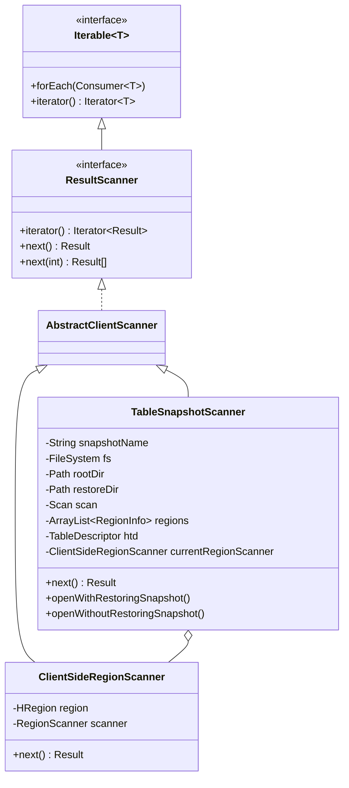

建议先阅读前文[HBase Snapshot基本原理](https://ddupg.github.io/blog/20230706-hbase-snapshot)。

HBase作为数据库，可以用于线上TP类需求，但如果直接基于HBase表运行AP类的离线分析型任务，则有2个问题：

- 可能会对线上读写产生影响，造成集群抖动。
- 速度慢

所以HBase提供了工具，可以直接越过HBase层直接读存储在HDFS上的文件，常用的就是Scan Snapshot功能。好处是：

- 在某个时间点打snapshot，基于snapshot做查询
- 直接读HDFS文件，避免与在线请求竞争HBase的计算资源，有效减轻对在线业务的影响。但如果对HDFS的吞吐过高也会有影响，所以也要根据集群规模考虑对IO限流。
- 速度快。可以基于MR实现，轻松实现弹性。并且因为跳过了HBase这一层，执行速度得到极大提高。

<!-- truncate -->

## 配置&权限

HBase是存算分离架构，数据持久化在HDFS上。但正常读写请求都是通过HBase层读写HDFS上数据，默认并不会给用户授予HDFS目录及文件的权限，则用户就不能读HDFS上的数据文件。所以要实现scan snapshot，第一步需要解决权限问题。

分两部分介绍

- 配置：配置打开后，才会将权限下放到HDFS目录和文件
- 实现：具体如何下放权限

### 配置

配置有两层：集群级别和表级别。

#### 集群级别

配置通过配置文件设置：`hbase.acl.sync.to.hdfs.enable`，默认false

只需要修改master的该配置项即可生效，无需修改全集群。

#### 表级别

记录在表的schame上，可以动态调整。

```
alter 't1', CONFIGURATION => {'hbase.acl.sync.to.hdfs.enable' => 'true'}
```

两层配置全部打开后，则表示该表的读权限需要同步加到HDFS的对应目录和文件。后面来看HBase是如何将权限下放的。

### 权限实现

scan snapshot需要对HDFS目录和文件加权限的逻辑，其实是基于`SnapshotScannerHDFSAclController`这个master的Coprocessor实现的。简单说，就是在表的各类操作前后增加hook，来处理表对应目录和文件的权限。

这个CP的具体实现细节很多，但没太多深入的内容，所以仅以`postCompletedCreateTableAction()`为例介绍，其他的可以举一反三。

#### postCompletedCreateTableAction

在建表操作的最后，会调用到CP的这个方法：

- 正常走shell或者admin接口createTable，触发的`CreateTableProcedure`会执行这个CP方法
- 执行clone snapshot建表，触发的`CloneSnapshotProcedure`会执行这个CP方法

以下是执行逻辑：

1. 检查该表是否需要添加acl权限，即非系统表 & 表的schame里有`hbase.acl.sync.to.hdfs.enable=true`
2. 创建表相关的目录，新表有些目录可能没有，方便之后的子目录继承权限。目录包含：
   - data目录：`{root}/data/{ns}/{table}/`
   - mob目录：`{root}/mobdir/data/{ns}/{table}/`
   - arthive目录：`{root}/arvhive/data/{ns}/{table}/`
3. 给表owner加HDFS的acl。这里的owner账号是触发建表的用户账号。
   1. 给namespace的相关目录加权限，仅一层目录不递归，仅ACCESS权限。目录包含：
      - tmp目录：`{root}/.tmp/data/{ns}/`
      - data目录：`{root}/data/{ns}/`
      - mob目录：`{root}/mobdir/data/{ns}/`
      - archive目录：`{root}/arvhive/data/{ns}/`
   2. 给table目录加hdfs的acl，递归处理所有子目录，ACCESS和DEFAULT权限，后续表目录下的子目录就会继承权限。目录包含：
      - data目录：`{root}/data/{ns}/{table}/`
      - mob目录：`{root}/mobdir/data/{ns}/{table}/`
      - arthive目录：`{root}/arvhive/data/{ns}/{table}/`
      - snapshot目录：该表的snapshot目录。
4. 记录到hbase:acl表。记录之后表示该表已经处理完了，之后比如revoke权限或删表时，会根据hbase:acl的记录来检查哪些表的哪些目录需要处理。

| rowkey    | CF | column | value |
| --------- | -- | ------ | ----- |
| tableName | m  | user   | R     |


### 小结

- 通过调整两级配置，打开开关，允许将表数据文件的读权限直接开放给用户。
- 具体的HDFS目录及文件的权限管理，由`SnapshotScannerHDFSAclController`这个CP实现。

## TableSnapshotScanner 单线程 scan snapshot

### 基本认识

直接来看`TableSnapshotScanner`的类图，从图中就能获得一些信息。



- 从继承关系中发现，`TableSnapshotScanner`间接实现了`ResultScanner`，所以其具备了单线程类似迭代器式地读表数据的能力。
- `TableSnapshotScanner`的属性来看，它是将snapshot关联的文件以region的形式组织起来，然后迭代读取的
  - snapshotName：snapshot相关信息
  - fs、rootDir、restoreDir：文件系统及目录相关信息
  - scan：如何读数据
  - regions：snapshot的region信息
  - currentRegionScanner：可以直接读region数据的scanner

### 重温restore snapshot

在我们读取snapshot关联文件的时候，一般是长时任务，如果过程中snapshot被删，文件也可能被清理，那任务则容易失败。所以需要一个办法，保证任务执行过程中，即使snapshot本身被删，其关联文件也应保留。

根据HBase HFile清理的逻辑，能想到的方法就是为关联的HFile建立一个link文件，表示文件还有用，不能删。这里就复用了restore snapshot。

在[Snapshot基本原理](https://ddupg.github.io/blog/20230706-hbase-snapshot)中有介绍restore_snapshot的记录原理，回顾2个重点：

- 使用snapshot恢复表，主要是**在文件系统中建立完整表目录**
- 不涉及数据文件拷贝，新表目录中的**文件都是link文件**

restore snapshot建表目录的位置是可配置的，用于恢复表时，选择的位置是正常的表数据目录`{root}/data/{ns}/table`。在用于scan snapshot的场景时，就没必要在表数据目录了，选择的位置默认则是：`/hbase/.tmpdir-to-restore-snapshot/{UUID}`

- 这个路径可以与HBase集群无关，可以不在集群的root目录下，甚至可以多集群使用一个目录做restore snapshot
- 这个路径是运行`TableSnapshotScanner`的client端传递的，而server端也会通过配置项配死（master的HFile清理会检查该目录下的引用），如果两者不匹配，HFile可能会被删导致任务失败
- 路径中的UUID是每次随机生成的，所以如果触发太多的`TableSnapshotScanner`，会产生大量目录和小文件，加重master和namenode的负担。后面会介绍解决方法。
- 目录需要给用户授权（保证用户可以建restore目录），也需要给master使用的管理员账号授权（保证master可以清理）。

### 读数据实现

#### TableSnapshotScanner重要逻辑

##### 关于restore snapshot

```java
/**  
* Creates a TableSnapshotScanner.
...
* @param snapshotAlreadyRestored true to indicate that snapshot has been restored. 
*/  
public TableSnapshotScanner(... , boolean snapshotAlreadyRestored) throws IOException {  
  ...
  if (snapshotAlreadyRestored) {
	this.restoreDir = restoreDir;
	openWithoutRestoringSnapshot();
  } else {
  // restoreDir will be deleted in close(), use a unique sub directory
	this.restoreDir = new Path(restoreDir, UUID.randomUUID().toString());
	openWithRestoringSnapshot();
  }
  ...
}
```

构造参数中的bool变量`snapshotAlreadyRestored`，表示是否已经完成restore snapshot，即是否复用restore snapshot的目录。以此来解决多次restore造成的小文件过多的问题。

比如在通过MR任务并行完成scan snapshot时，就可以进行一次restore snapshot，复用其目录，并行执行多个scanner加速处理。

##### 如何读数据

逻辑也比较简单，直接看代码和注释就好。

```java
@Override
public Result next() throws IOException {
  Result result = null;
  while (true) {
    if (currentRegionScanner == null) {
      currentRegion++;
      // 所有region都已读完，结束
      if (currentRegion >= regions.size()) {
        return null;
      }
      // 当前region读完，通过ClientSideRegionScanner读下一个region
      RegionInfo hri = regions.get(currentRegion);
      currentRegionScanner = 
        new ClientSideRegionScanner(conf, fs, restoreDir, htd, hri, scan, scanMetrics);
      ...
    }

    try {
      result = currentRegionScanner.next();
      if (result != null) {
        // 按scan的limit限制，结束请求
        if (scan.getLimit() > 0 && ++this.numOfCompleteRows >  scan.getLimit()) {
          result = null;
        }
        return result;
      }
    } finally {
      // 当前currentRegionScanner已经读完，进行清理
      if (result == null) {
        currentRegionScanner.close();
        currentRegionScanner = null;
      }
    }
  }
}
```

核心的功能由`ClientSideRegionScanner`实现。

##### ClientSideRegionScanner

`ClientSideRegionScanner`实际上并不复杂，其充分复用了`HRegion`的代码来实现对目标region数据文件的读取。

```java
public ClientSideRegionScanner(Configuration conf, FileSystem fs, Path rootDir, 
TableDescriptor htd, RegionInfo hri, Scan scan, ScanMetrics scanMetrics) throws IOException {
  // region是只读的，所以隔离级别不会影响结果
  scan.setIsolationLevel(IsolationLevel.READ_UNCOMMITTED);

  htd = TableDescriptorBuilder.newBuilder(htd).setReadOnly(true).build();  

  // 为region指定目录，构造HRegion对象。在scan snapshot时这里的root目录实际是restore的目录
  region = HRegion.newHRegion(CommonFSUtils.getTableDir(rootDir, htd.getTableName()), null, fs,
    conf, hri, htd, null);
  // 设置此时是在restore region，避免对文件系统有修改。比如replay wal
  region.setRestoredRegion(true);
  // 只开启L1的block cache，只缓存HFile的index block，减少内存使用
  conf.set(BlockCacheFactory.BLOCKCACHE_POLICY_KEY, "IndexOnlyLRU");  
  conf.setIfUnset(HConstants.HFILE_ONHEAP_BLOCK_CACHE_FIXED_SIZE_KEY,  
    String.valueOf(HConstants.HBASE_CLIENT_SCANNER_ONHEAP_BLOCK_CACHE_FIXED_SIZE_DEFAULT));
  // don't allow L2 bucket cache for non RS process to avoid unexpected disk usage.
  conf.unset(HConstants.BUCKET_CACHE_IOENGINE_KEY);
  region.setBlockCache(BlockCacheFactory.createBlockCache(conf));
  region.setMobFileCache(new MobFileCache(conf));
  region.initialize();
  
  // 构造该region的scanner
  this.scanner = region.getScanner(scan);
  values = new ArrayList<>();
  ...
  region.startRegionOperation();
}
```

- `ClientSideRegionScanner`使用指定目录构造`HRegion`，在scan snapshot的场景时，该目录则是`/hbase/.tmpdir-to-restore-snapshot/{UUID}`
- 随后则使用`HRegion`的`RegionScanner`来读数据。该scanner的细节就不展开了，RegionServer读数据也会最终用到这个`RegionScanner`。

### 小结

- `TableSnapshotScanner`实现上很巧妙。大量复用了已有功能和代码。
- 复用restore snapshot：以表目录及link文件形式组织数据，同时另起目录不污染线上表数据
- 复用`HRegion`：以region形式识别restore的目录，借助region的代码实现数据读取
- `TableSnapshotScanner`只实现了单线程读snapshot的能力，对于大数据量读取速度过慢，但可以基于它进一步实现MR版本。

## MR并行扫描snapshot

为了使用MR任务跑scan snapshot，到目前为止，只需要解决2个问题：

- 任务如何分片？默认每个region一个分片。
- 每个分片如何执行？类似`TableSnapshotScanner`

这部分核心逻辑的入口在`TableSnapshotInputFormat`

### 如何分片

方法入口在`org.apache.hadoop.hbase.mapreduce.TableSnapshotInputFormat#getSplits`，最终实现在`org.apache.hadoop.hbase.mapreduce.TableSnapshotInputFormatImpl#getSplits`。

简单说：默认每个region一个分片。可以通过参数调整每个region产生多个分片，但这里不展开了。

### 如何执行

实现类是`org.apache.hadoop.hbase.mapreduce.TableSnapshotInputFormatImpl.RecordReader`，实际也是使用了`ClientSideRegionScanner`实现，和`TableSnapshotScanner`基本类似，所以不再展开。

## 总结

- [HBase Snapshot基本原理](https://ddupg.github.io/blog/20230706-hbase-snapshot)之前一篇文章介绍了HBase Snapshot的基本原理，本文围绕如何利用snapshot直接读取HDFS数据文件来加速查询
- 权限部分解决了如何让用户能顺利读到文件
- 其次介绍了如何实现单线程的读snapshot
- 最后介绍了如何使用MR来读snapshot，加速查询
