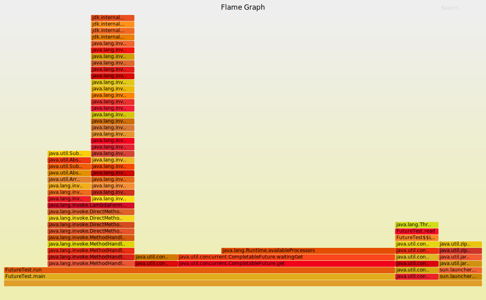

最近的工作内容就是写一个 `DualHBaseClient`，在查询数据时间过长时，能够将同样的请求发给 replication 的集群，缩小 client 端的 p99、p999 延迟，减小毛刺。
实际开发最初的一版代码都没有花费1pd，性能测试倒测了好几天都不及预期，甚至优化之后各方面性能更差劲。

本文就是记录下导致此次性能问题的主要原因：CompletableFuture.

使用 Java 异步编程的时候，`CompletableFuture` 用起来还是相当舒服的，在HBase的异步API里，也大量的使用了`CompletableFuture`，如果 `CompletableFuture` 有性能问题，那可就悲催了。

<!-- truncate -->

看下以下这段测试`CompletableFuture`的代码

```
import com.google.common.collect.Lists;

import java.util.List;
import java.util.concurrent.CompletableFuture;
import java.util.concurrent.ExecutionException;

public class FutureTest {

    public static void main(String[] args) throws ExecutionException, InterruptedException {
        new FutureTest().run();
    }

    private void run() throws ExecutionException, InterruptedException {
        List<CompletableFuture> futures = Lists.newArrayList();
        for (int i = 0; i < 1000; i++) {
            CompletableFuture future = new CompletableFuture();
            CompletableFuture f = CompletableFuture.runAsync(this::read);
            f.whenComplete((r, e) -> future.complete(r));
            futures.add(future);
        }
        for (CompletableFuture future : futures) {
            future.get();
        }
    }

    private void read() {
        try {
            Thread.sleep(100);
        } catch (InterruptedException e) {
            e.printStackTrace();
        }
    }
}
```

以上这段代码实际只是让 `CompletableFuture` 空转，除了 sleep 没再做其他的，循环1000让运行时间尽量长一些，足够让我们跑一个火焰图出来。



火焰图里注意到有个最大的平顶 `java.lang.Runtime.availableProcessors`，该方法耗时极大，甚至超过了 Thread.sleep，这可不正常吧。

随后我们测下 `java.lang.Runtime.availableProcessors()` 方法是不是真的慢。

```
import com.google.common.base.Stopwatch;
import org.junit.Assert;
import org.junit.Test;

import java.util.concurrent.TimeUnit;

public class AvailableProcessorsTest {

    @Test
    public void test() {
        Stopwatch sw = Stopwatch.createStarted();
        for (int i = 0; i < 1000000; i++) {
            Runtime.getRuntime().availableProcessors();
        }
        Assert.assertTrue(sw.elapsed(TimeUnit.SECONDS) > 10);
    }
}
```

在我的机器上循环1000000次，耗时超过了10s，不算快。

再来看看 `CompletableFuture` 是怎么使用 `Runtime.availableProcessors()` 的

```
private Object waitingGet(boolean interruptible) {
    ...
    while ((r = result) == null) {
        if (spins < 0)
            spins = (Runtime.getRuntime().availableProcessors() > 1) ?
                1 << 8 : 0; // Use brief spin-wait on multiprocessors
        else if (spins > 0) {
            if (ThreadLocalRandom.nextSecondarySeed() >= 0)
                --spins;
        }
        ...
    }
    ...
}
```

while 死循环要直到出现异常或获取到最终结果才会结束，而循环中又会大量调用 `Runtime.availableProcessors()`，这就是`CompletableFuture`存在的性能问题。

而实际上Openjdk已有对该问题的讨论，[JDK-8227018](https://bugs.openjdk.java.net/browse/JDK-8227018)，该优化也很简单，在这里其实只是需要知道运行环境是不是多处理器环境而已，缓存起来就好，完全没必要每次循环都去获取。在jdk8u232版本就fix掉了。

而且我还看了 jdk11、jdk13 的实现，都不再使用`Runtime.availableProcessors()`了，所以算是低版本 jdk8 用户独有的烦恼。

> 一个小插曲
> 
> jdk8u232版本是2019.10.15才正式release的，而我发现这个问题是在10.13。
> 也幸运也不幸，幸运的是起码问题fix掉了，不幸的是 DualHBaseClient 不能采用 CompletableFuture 实现了，总不好要求用户升级jdk吧

知道低版本的 jdk8 有问题之后，`DualHBaseClient` 还是要写的，只能寻求其他的异步框架来实现，好在 guava 的 `ListenableFuture` 实现很像`CompletableFuture`。

## 总结

如果是jdk8低版本用户（刚发布几天不会有公司升级吧）频繁的大量使用 CompletableFuture，是存在性能问题，升级 jdk 是最简单的办法，使用 guava 的 Future 库实现也可以，但可能要大量修改代码了。

## 附录

- [火焰图排查Java性能问题](https://blog.wangqi.love/articles/Java/%E7%81%AB%E7%84%B0%E5%9B%BE%E6%8E%92%E6%9F%A5Java%E6%80%A7%E8%83%BD%E9%97%AE%E9%A2%98.html)
- [JDK-8227018](https://bugs.openjdk.java.net/browse/JDK-8227018)