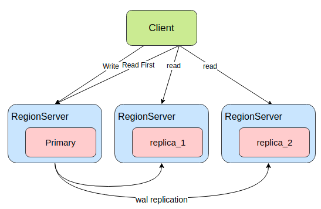
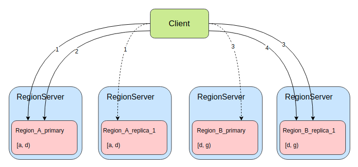
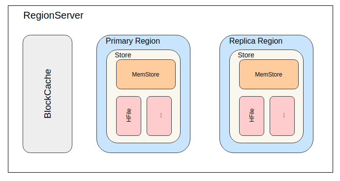
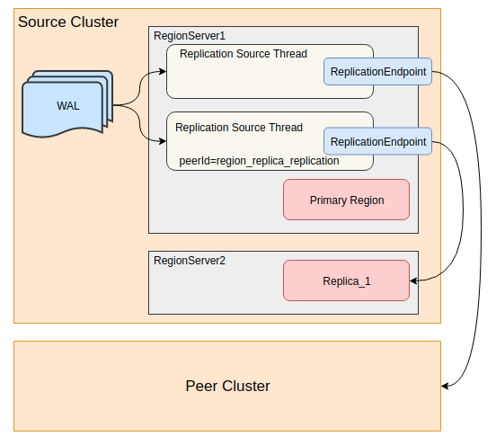

<!-- truncate -->

## 背景

CAP原理中，指出对于一个分布式系统来说，不可能同时满足一致性 (Consistency)、可用性（Availability）、分区容错性（Partition tolerance），而HBase则被设计成一个CP系统，保证了强一致性的同时，选择牺牲了一定的可用性。

在对HBase的压测中，很容易发现虽然HBase的平均读写延迟很低，但却存在很高的毛刺，P99、P999延迟很高，主要的一个影响因素则是单点的GC，另外Region的MTTR（平均修复时间）也较高，一旦某个RegionServer宕机或某个Region出现问题，甚至是一次Full GC，都有可能出现较长时间的不可用，影响可用性。

HBase的Read Region Replicas功能，提供一个或多个副本，在region恢复期间或请求时间过长时，支持最终一致性的读服务。在一些不要求强一致性的应用中，可以通过此功能来提高可用性降低读请求延迟。

为了实现高可用读，HBase提供了一个feature，叫`region replication`。在这种模型下，表的每个region，都会有多个副本，分布在不同的RegionServer上。默认region replication为1，此时与之前的region模型并无不同。当region replication被设置为2或更多时，Master将会assign所有region的secondary region，Load Balancer会保证同一个region的多个备份会被分散在不同的RegionServer上。

一个region的所有副本都有一个唯一的replica_id。replica_id=0的是primary region（和之前模型中唯一的region一样），其他的副本region被都叫做secondary region。

primary region，支持读写请求；secondary region，只支持读请求。如此设计保证primary region依旧具有强一致性，同时提高读可用性。但也因为写请求只有primary region可以处理，所以写请求依然会因为primary region不可用而被阻塞，HBase的写可用性依然没有得到改善。

## Timeline Consistency

在该功能的实现中，HBase提供了一种支持**单次读请求**的一致性定义。

```Java
public enum Consistency {
    STRONG,
    TIMELINE
}
```

HBase默认的就是`Consistency.STRONG`强一致性模型，与之前的模型一样，所有读写操作都通primary region完成。

而当client使用`Consistency.TIMELINE`的一致性发起读请求时，会首先向primary region发起请求，一定时间内没有返回响应，则同时并发向所有的secondary region发起请求，最终采用率先返回的请求。为了区分最终的响应是否来自secondary region，在`Result`中增加了`stale`的boolean属性，`true`则表示来自secondary region。

从语义上讲，HBase的TIMELINE一致性并不同于常见的最终一致性解决方案。

- 即使存在多副本，也不需要考虑副本之间数据冲突的问题。
- secondary region接收primary region同步的数据，按同样顺序处理数据，所以secondary region总是primary region在之前某个时刻的快照。从这一点上看，更像是RDBMS（关系型数据库管理系统）的复制、或是HBase多数据中心多集群之间的复制。
- 另一方面，client可以自行决定是否需要读取最新数据，自行决定使用哪一种一致性来满足功能需求。
- client依然会读到乱序的数据，比如多次请求发往了不同的region。目前并没有类似于事务的东西来解决这个问题。


根据上图我们来更好的理解TIMELINE的语义。首先client1按顺序写了x=1,x=2,x=3，primary region也按写入顺序处理，并将WAL同步给其他secondary region（一种数据同步方式，后面会再讲）。在图中注意到，replica_1只接收到两次更新，所以最终数据是x=2，replica_2只接收到1次更新，数据是x=1。

如果client1使用STRONG一致性来读数据，都只会和primary region交互，数据都是最新值x=3。可如果使用TIMELINE一致性读取数据，有可能和所有副本做交互，最终获得的数据1、2、3都有可能。如果client请求多次，甚至可能出现数据回退，即第1次请求获得x=2，第2次请求则获得了x=1。

## 实现

### 数据模型


在上图中，是一个region replication为2的表在meta表中info列族下的列，可以看到有一些名为info:xxx_0001的列，这些列存储的数据就是replica_id=1的secondary region的数据。同理，当region的备份数量更多时，meta表中名为info:xxx_0002、info:xxx_0003的列存储的则为replica_id为2、3的secondary region的数据。

明白了meta表中是如何存储secondary region数据，client要获取secondary region所在的RegionServer自然也简单，多解析几个server_xxxx的列便可以了。



上图展示的是client访问secondary region的示意图。HBase的读请求有两种，Get和Scan。对于Get这种无状态的请求，每次RPC对server端来说都是一次独立的请求。client端的用户可以多次超时重试，直到获取到数据；也可以并发请求多个replica，选择率先返回的数据；还可以使用TIMELINE Read，请求primary region超时之后再请求其他secondary region。但对于Scan这种有状态的请求，一次scan可能与同一个region交互多次，也可能跨多个region多个RegionServer请求数据，server端会记录每个scan的状态数据，那么一次scan产生的多次RPC便不能随意地发给所有的replica。



上图展示的是client执行一个跨region的scan过程，假设当前表有2个逻辑region（Region_A和Region_B），region的起始区间分别为[a, d)、[d, f)，且该表的region replication为2，即每个逻辑region都有一主一备，4个region分布在4个RegionServer上。当我们执行一次scan操作，设置cacheing为2（每次RPC最多获取2个Result），则scan至少进行4次RPC，图中连线则表示每次RPC，连线上的数字表示RPC的顺序编号，虚线表示RPC超时或返回太慢结果没有被采用。可以看到当client要进行第1次RPC时，将请求同时发给了Region_A的主备2个region，因为此时server端是没有任何关于此次scan的状态数据，client可以选择率先返回响应的region进行后续的RPC交互。当第2次RPC时便不可以随意选择region了，因为Region_A_primary存储了此次scan的状态数据，而Region_A_replica_1没有，如果请求Region_A_replica_1则只会抛出异常。当第2次RPC结束，已经获取了Region_A中的全部数据，便可以清理掉Region_A_primary中存储的状态数据了。当第3次RPC时，和第1次时情况有些类似，server端暂时没有存储scan的状态数据了，client便可以像第1次RPC一样，将请求同时发给了Region_A的主备2个region。第4次RPC则像第2次一样。总结一下：当scan进行TIMELINE Read时，只有对每个逻辑region的第1次rpc可以任意选择region请求。

目前，Read Region Replicas功能并没有支持批量请求，即批量Get、Scan都是直接请求primary region。

### 数据同步

secondary region要支持读请求，则必然要有数据，而secondary region又不支持写请求，那么数据是哪来的呢？



从HBase的数据模型上看，数据主要分为两部分：MemStore和HFile。HFile存储于HDFS上，secondary region只要及时获知HFile的变化便可以获取。但MemStore存在于内存，却只有primary region持有。以下便介绍两种secondary region同步数据的方式。

#### StoreFile Refresher

第一种方式是StoreFile Refresher，在HBase-1.0+版本引入。在RegionServer上有一个StorefileRefresherChore任务，会定期地在HDFS上检查primary region的HFile有没有变化，以此来及时的发现primary region通过flush、compact、bulk load等操作产生的新HFile。

该方案实现上较为简单，也不需要太多多余的存储和网络开销，但缺点也非常明显，在数据写入primary region，到secondary region可以读到数据，有相当长的时间间隔，中间需要等待memstore的flush和StorefileRefresherChore任务的定时刷新。

如果要开启这个功能，只要将`hbase.regionserver.storefile.refresh.period`配置设置为非零值即可，表示StorefileRefresherChore任务刷新的时间间隔。

#### Asynchronous Replication

HBase有提供集群间replication功能，利用WAL在多个集群之间同步数据。在HBase-1.1+版本中，便利用replication在集群内部同步数据，将实时写入的WAL同步到secondary region。



如上图中所示，通过实现一个特殊的`ReplicationEndpoint`便可以将WAL的数据同步给集群中的其他RegionServer。如此primary region MemStore中的数据，也通过replication实时同步到secondary region，从secondary region中也可以读到primary region还没有flush到HFile的数据。所以利用`Asnyc WAL replication`的同步方式比上面讲到的`StoreFile Refresher`同步方式具有更低的同步延迟。

primary region还会将flush、compaction和bulk load事件写到WAL，同样由replication功能同步到secondary region。当secondary region接收到这些事件时，便也回放同样的事件来更新自己的数据。所以对HFile文件列表的更新也比`StoreFile Refresher`定时刷新的方式更加实时。

在这种同步模式下，secondary region的MemStore中也是有数据，从WAL同步的Put/Delete操作就pPrimaryrRegion一样写入MemStore，并且secondary region也会使用block cache，所以在这种模式中内存的开销会成倍的增长。不同于primary region的是，secondary region在接收到flush事件时，并不会将MemStore中的数据flush成HFile，只会释放掉MemStore占用的内存。

`Asnyc WAL replication`功能默认是关闭的。需要设置`hbase.region.replica.replication.enabled`为`true`来打开这个功能。当第一次创建一个region replication大于1的表时，将会创建一个名为`region_replica_replication`的replication peer，这个replication peer将负责集群内所有表region replica的数据同步。一旦开启之后想要再关闭该功能，就不只是改`hbase.region.replica.replication.enabled`为`false`了，还需要disable掉`region_replica_replication`这个replication peer。

### 存在的问题

#### HFile的过期时间

在以上两种数据同步方式中，都会在多个RegionServer上打开同一个HFile，所以当primary region进行完了major compaction之后，secondary region因为HFile文件变化更新不及时，依旧引用着旧的HFile。目前并没有有效的措施保证HFile文件并不会被过早的删除。只能是将配置项`hbase.master.hfilecleaner.ttl`设置为一个较大的值，比如一小时，以此来尽量避免请求过程中不会出错。但同时也会增加HDFS的存储开销。

#### replication不能同步meta表数据

目前的Asynchronous Replication功能并不能同步meta表的WAL数据（最初该功能是用于集群间同步数据的，毕竟不能把meta数据同步给其他集群）。所以对于meta表的操作，并不能通过replication尽快的同步到secondary region，只能通过类似于`StoreFile Refresher`的方式，使用定时刷新的任务来同步meta表HFile文件的变化。

`hbase.regionserver.meta.storefile.refresh.period`配置项用于控制meta表StoreFile的更新时间。该配置项并不同于`StoreFile Refresher`功能的`hbase.regionserver.storefile.refresh.period`。

#### 内存消耗

在之前已经提到，Asynchronous Replication同步因为使用MemStore和block cache，会导致内存开销成倍增加。并且secondary region并不会主动进行flush，只会当接收到同步的WAL中的flush事件时，才会进行flush。在一些极端情况下，比如replication阻塞收不到flush事件、primary region确实长时间没有进行flushsecondaryarRegion持有的内存得不到释放，而一个RegionServer上同时有多个primary region和secondary region，内存的过度消耗可能会阻塞primary region正常的写入操作，也会阻塞replication同步的flush事件。

所以HBase提供了一个配置项`hbase.region.replica.storefile.refresh.memstore.multiplier`，默认值为4，表示如果secondary region的MemStore比primary region最大的MemStore的4倍还要大时，便允secondaryarRegion自行refresh检查HFile文件是否变化，如果primary region早已flush过，却因为replication阻塞没有同步到，则可以利用该机制进行flush。默认情况下最好不要执行这个操作，可以把该配置项设置大一些来避免。

#### secondary region Failover

当一个secondary region刚open或者fail over，此时必然丢失了之前MemStore的数据，因为secondary region毕竟不能像primary region一样通过回放WAL来恢复MemStore。如果此时直接提供读服务，则可能出现数据版本回退的问题，即恢复之后比恢复之前读到的数据更旧。为了避免数据回退，secondary region就必须等待primary region进行一次完整的flush操作或open region事件，在这之前，secondary region都将拒绝接服务。

`hbase.region.replica.wait.for.primary.flush`配置项是该机制的开关，默认是`enable`开启。

## 使用

### 配置

**server端**

| 配置项                                                        | 默认值                                                            | 单位  | 描述                                                                                           |
| ---------------------------------------------------------- | -------------------------------------------------------------- | --- | -------------------------------------------------------------------------------------------- |
| hbase.regionserver.storefile.refresh.period                | 0                                                              | 毫秒  | secondary region刷新storefile的时间间隔，默认0为关闭                                                      |
| hbase.regionserver.meta.storefile.refresh.period           | 0                                                              | 毫秒  | secondary region刷新hbase:meta表storefile的时间间隔，默认0为关闭                                           |
| hbase.region.replica.replication.enabled                   | false                                                          |     | 是否开启`Asnyc WAL replication`功能，开启后再想关闭，需要改为false之后再disable掉`region_replica_replication`的peer  |
| hbase.master.hfilecleaner.ttl                              | 300000(5分钟)                                                    | 毫秒  | storefile文件的过期删除时间间隔                                                                         |
| hbase.meta.replica.count                                   | 1                                                              | 个   | meta表的region replication数量                                                                   |
| hbase.region.replica.storefile.refresh.memstore.multiplier | 4                                                              | 倍   | secondary region的MemStore大于同RegionServer上primary region最大的MemStore该倍数时，会触发刷新storefile文件列表的任务 |
| hbase.region.replica.wait.for.primary.flush                | true                                                           |     | secondary region open之后，是否要等待primary region进行一次flush再提供服务                                    |
| hbase.master.loadbalancer.class                            | org.apache.hadoop.hbase.master.balancer.StochasticLoadBalancer |     | 默认的实现可以保证region的replicas尽量不会分布在同一个RegionServer上，如果修改该配置，要注意replicas的分布                       |

**client端**

| 配置项                                       | 默认值   | 单位  | 描述                                                             |
| ----------------------------------------- | ----- | --- | -------------------------------------------------------------- |
| hbase.ipc.client.specificThreadForWriting | false |     | 是否使用特殊线程用于写请求。使用region replicas功能，经常会在IO过程中中断线程，所以必须开启该配置      |
| hbase.client.primaryCallTimeout.get       | 10000 | 微秒  | TIMELINE一致性Get时，等待primary region响应的时间，超时之后便请求secondary region  |
| hbase.client.primaryCallTimeout.scan      | 10000 | 微秒  | TIMELINE一致性Scan时，等待primary region响应的时间，超时之后便请求secondary region |
| hbase.meta.replicas.use                   | false |     | 是否使用meta表的secondary region                                     |

### 建表

`REGION_REPLICATION`参数控制表中region有多少备份，默认值为1，即只有primary region。

shell方式建表

```shell
create 't1', 'f1', {REGION_REPLICATION => 2}
```

shell方式修改表

```shell
alter 't1', {REGION_REPLICATION => 2}
```

### Client

Client访问secondary region必须要用户明确的表示可以接收非强一致性的数据，如果希望请求可以发送给secondary region，必须明确指定为`TIMELINE`的一致性。

```Java
public enum Consistency {
    STRONG,
    TIMELINE
}
```

#### Shell

允许以`TIMELINE`的一致性读取数据

```shell
hbase(main):001:0> get 't1','r6', {CONSISTENCY => "TIMELINE"}
```

```shell
hbase(main):001:0> get 't1','r6', {CONSISTENCY => "TIMELINE", , REGION_REPLICA_ID => 1}
```

#### Java

Get

```Java
Get get = new Get(row);
get.setConsistency(Consistency.TIMELINE);
...
Result result = table.get(get);
```

Scan

```Java
Scan scan = new Scan();
scan.setConsistency(Consistency.TIMELINE);
...
ResultScanner scanner = table.getScanner(scan);
```

可以通过`Result.isStale()`判断数据是否来自于secondary region

```Java
Result result = table.get(get);
if (result.isStale()) {
  ...
}
```

## 性能测试

**机器配置**

HBase版本：2.2.0
HDFS版本： 3.1.4

| service | job           | 实例数 | cpu     | disk        | netowork | comment                |
| ------- | ------------- | --- | ------- | ----------- | -------- | ---------------------- |
| HBase   | master        | 2   | -       | -           | -        | -                      |
| HBase   | region server | 5   | 24 core | 12*3.7T HDD | 10000bps | onheap=50g/offheap=50g |
| HDFS    | namenode      | 2   | -       | -           | -        | onheap=10g             |
| HDFS    | datanode      | 5   | 24 core | 12*3.7T HDD | 10000bps | onheap=2g              |

**不限制QPS**

|                  | strong    | timeline-10ms | reta    |
| ---------------- | --------- | ------------- | ------- |
| qps_sec          | 12608.23  | 11171.18      | -11.4%  |
| max_latency_us   | 195174.38 | 202603.69     | 3.81%   |
| min_latency_us   | 149.38    | 148.75        | -0.42%  |
| avg_latency_us   | 3760.69   | 4276.76       | 13.72%  |
| p90_latency_us   | 11811.92  | 14258.31      | 20.71%  |
| p99_latency_us   | 32512.23  | 31148.14      | -4.2%   |
| p999_latency_us  | 64646.38  | 58621.93      | -9.32%  |
| p9999_latency_us | 136835.92 | 115951.63     | -15.26% |

**限制7000QPS**

|                  | strong    | timeline-10ms | reta    |
| ---------------- | --------- | ------------- | ------- |
| qps_sec          | 6999.58   | 6999.56       | -0.0%   |
| max_latency_us   | 126860.75 | 130148.86     | 2.59%   |
| min_latency_us   | 147.25    | 150.68        | 2.33%   |
| avg_latency_us   | 3223.38   | 3495.51       | 8.44%   |
| p90_latency_us   | 10612.49  | 11379.48      | 7.23%   |
| p99_latency_us   | 23793.54  | 24469.25      | 2.84%   |
| p999_latency_us  | 48791.00  | 39795.06      | -18.44% |
| p9999_latency_us | 93389.08  | 78618.61      | -15.82% |

对单Client实例做压力测试，`hbase.client.primaryCallTimeout.get`参数设置为10000，即等待primary region响应的时间超时10ms之后便请求secondary region。

第一组极限QPS的压测中，可以看出开启TIMELINE Read之后，QPS有一定损失，平均延迟有一定升高，P999和P9999一定程度优化。优化效果有限。

因为read replicas会增加线程资源的使用，而日常使用也不会把Client侧压到极限，所以又做了一组限制QPS的压测，可以看到各项延迟指标均有所好转。

## 总结

`Region Replica`功能可以提高HBase的读可用性，但也要根据具体的用例考虑是否适用。

### 优点

- 当应用依赖是只读的表，或者应用并不要求强一致性（要求最终一致性，可以接受短时间内数据不一致）时，可以使用该功能来提高读可用性。在RegionServer或Region出现单点故障恢复期间或长时间Full GC期间尽量保证业务读请求正常，减少MTTR过长对业务产生的影响，同时也可以减少大量重试请求进一步地增加故障节点的压力。
- 对于部分不要求强一致性且对延迟毛刺有一定要求的应用，当在Client侧QPS较低或CPU、带宽等资源富余时，可以使用该功能降低读请求P99/P999和P9999延迟。

### 缺点

- 多倍的MemStore导致更多的内存消耗
- 增加block cache的需求和使用
- 为了传输WAL导致更多的网络带宽消耗
- 大量的集群内部RPC请求

## 参考

- [Timeline-consistent High Available Reads](http://hbase.apache.org/book.html#arch.timelineconsistent.reads)
- [HBASE-10070](https://issues.apache.org/jira/browse/HBASE-10070)
- [HighAvailabilityDesignforreadsApachedoc.pdf](https://issues.apache.org/jira/secure/attachment/12616659/HighAvailabilityDesignforreadsApachedoc.pdf)
