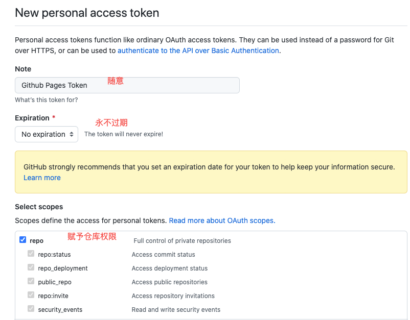
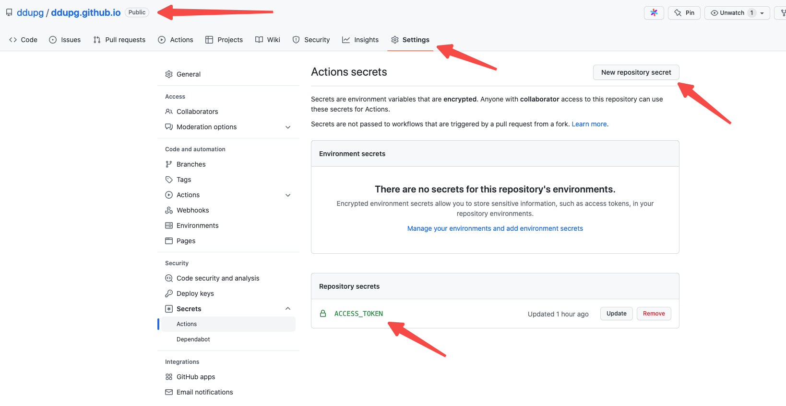
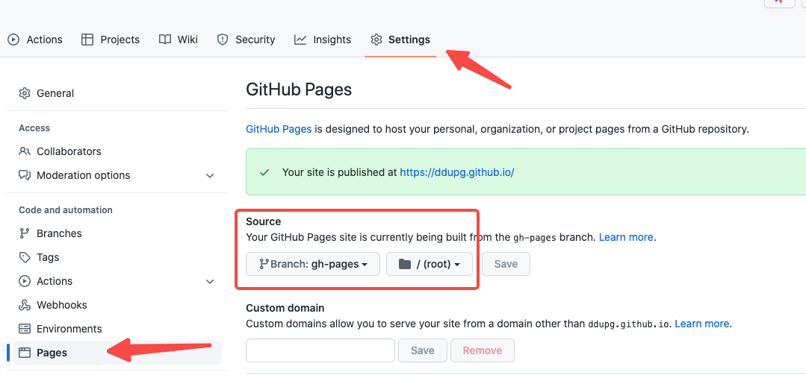

部署到GitHub Pages。官网支持很多种方法，我选了GitHub Action。
我有几台电脑，几套开发环境，如果每个都配一遍也够麻烦的，毕竟不是专业的前端。用GitHub Action的话，写简单博客或者文档直接push到仓库就好了，甚至可以在GitHub的网页编辑，方便得很。

<!-- truncate -->

## 新建GitHub仓库&上传代码

上一步只能在本地运行部署，要把它部署到GitHub Pages，得先上传到GitHub的一个仓库里。

我这里就是上传到了ddupg.github.io仓库。

> 以github.io后缀的仓库名，GitHub会默认这是个GitHub Pages项目，如果是其他项目还需要自己配置GitHub Pages。具体看下[官网介绍](https://pages.github.com/)。

## 配置Access Token

### 生成

生成一个专用于GitHub Pages部署用的access token，GitHub Action需要用这个token才能部署。

在自己的GitHub账号里，从页面右上角开始：

*Setting ->Developer settings ->  Personal access tokens*

生成一个新的token，记得复制下来，马上要用：



### 配置



这里的环境变量名后面要用，不要乱起名。环境变量的值，就是上一步生成的token。

## 配置GitHub Action

详细的可以看[Docusaurus文档](https://www.docusaurus.cn/docs/deployment#triggering-deployment-with-github-actions)

配置GitHub Action非常简单，只需要在自己的项目的固定目录新加个配置文件就好了。

- 文件名随意。目录必须是：`.github/workflows/`

- 如果你的默认主分支不是main，那就改下`on.push.branches`。如果其他分支也需要触发，那也加上分支名。

- 如果你的环境变量名字不是`ACCESS_TOKEN`，就改个环境变量名，其他的不要动

```yml title=".github/workflows/ci.yml"
name: Deploy to GitHub Pages

on:
  push:
    branches:
      - main

jobs:
  deploy:
    name: Deploy to GitHub Pages
    runs-on: ubuntu-latest
    steps:
      - uses: actions/checkout@v2
      - uses: actions/setup-node@v3
        with:
          node-version: 16.x
          cache: yarn

      - name: Install dependencies
        run: yarn install --frozen-lockfile
      - name: Build website
        run: yarn build

      # Popular action to deploy to GitHub Pages:
      # Docs: https://github.com/peaceiris/actions-gh-pages#%EF%B8%8F-docusaurus
      - name: Deploy to GitHub Pages
        uses: peaceiris/actions-gh-pages@v3
        with:
          github_token: ${{ secrets.ACCESS_TOKEN }}
          # Build output to publish to the `gh-pages` branch:
          publish_dir: ./build
```

## 最后

把修改后的配置文件push到仓库就好了，GitHub Action会自动触发。

再修改下GitHub Pages使用的分支，这事就成了。



## 参考

[Docusaurus文档](https://www.docusaurus.cn/)